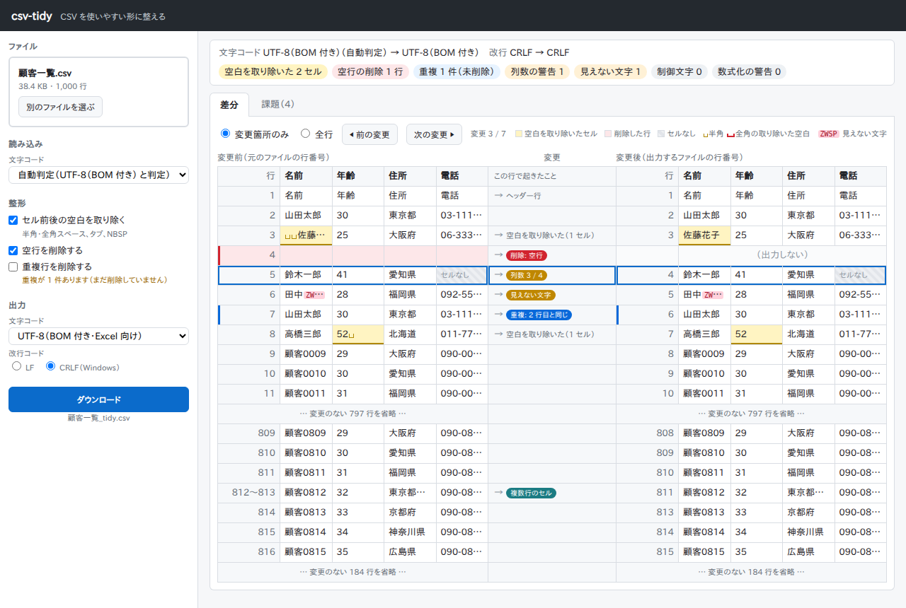
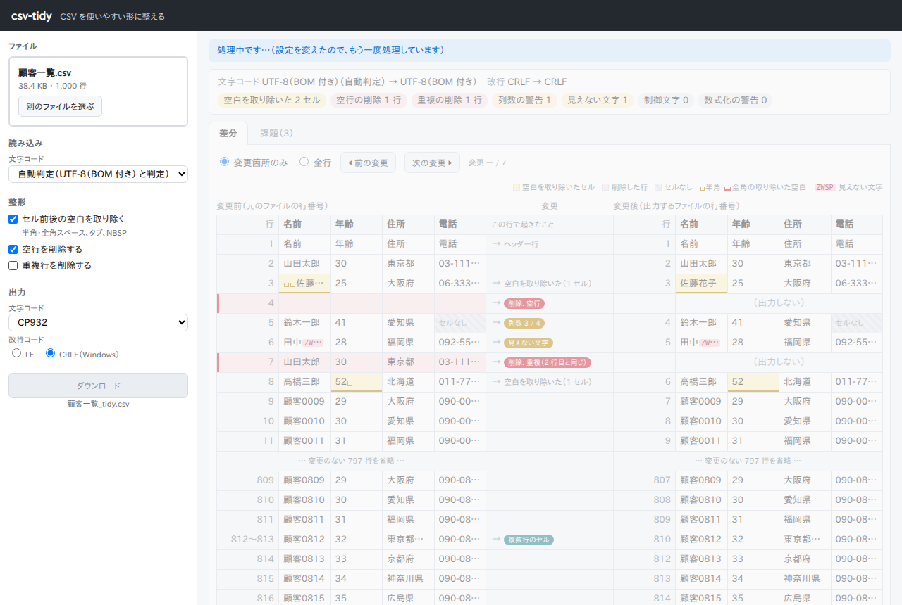

# csv-tidy

CSV ファイルを使いやすい形に整える Web アプリです。文字コードの変換と、空白・空行・重複の整理を行い、**何をどう変えたかを変更前と並べて確認してから**ダウンロードできます。

学習とポートフォリオ（自分の技術力を示す作品集）のために作りました。[Claude Code](https://claude.com/claude-code)（AI のコーディング支援ツール）と一緒に、要件定義・設計・実装・テストまでの過程を、すべてこのリポジトリに記録しています（[開発の過程](#開発の過程)）。



## できること

| 機能 | 内容 |
| --- | --- |
| 文字コードの判定と変換 | 読み込むファイルの文字コード（UTF-8、BOM 付き UTF-8、CP932＝Windows の Shift_JIS）を自動で判定します。判定が違うときは指定し直せます。出力は UTF-8、BOM 付き UTF-8（Excel 向け）、CP932 から選べます |
| 改行コードの変換 | 出力の改行を LF（Mac・Linux）か CRLF（Windows）から選べます |
| 空白の除去 | セルの前後にある半角・全角スペース、タブ、NBSP（改行しない空白）を取り除きます。セルの中の空白は残します |
| 空行・重複行の削除 | すべてのセルが空の行を削除します。重複行の削除は、意図した重複を消さないよう初期状態ではオフにし、件数と場所だけを知らせます |
| 問題の検出 | 列数がヘッダーと違う行、見えない文字（ゼロ幅スペースなど）や制御文字、整形によって `=` などで始まり表計算ソフトで数式として扱われるようになった値、CP932 で表せない文字を、行と列の場所付きで知らせます。値は書き換えません |
| 変更前後の比較 | 変更前と変更後を左右に並べ、中央の帯にその行で起きたことを表示します。「変更箇所のみ」と「全行」を切り替えられ、課題の一覧から該当する行へ移動できます |
| ダウンロード | 整形した結果を `元の名前_tidy.csv` として保存します。元のファイルは書き換えません |

どの処理も「変更するのは利用者が選んだ処理だけ」「変更はすべて見せる」「元のファイルは書き換えない」という原則（[要件定義書 1.1](docs/requirements.md)）に沿っています。

## 動かし方

### 必要なもの

- [uv](https://docs.astral.sh/uv/)（Python とライブラリをまとめて管理するツール）。Python 3.11 以上がなければ、uv が自動で入れます
- [Git](https://git-scm.com/)（リポジトリを取得するため。ZIP でダウンロードする場合は不要）
- ブラウザ（Chrome・Edge・Firefox の最新版）

### 手順

1. uv を入れます（初回だけ）。

   ```sh
   # Mac・Linux
   curl -LsSf https://astral.sh/uv/install.sh | sh
   ```

   ```powershell
   # Windows（PowerShell）
   powershell -ExecutionPolicy ByPass -c "irm https://astral.sh/uv/install.ps1 | iex"
   ```

   入れた後は、ターミナルを開き直してください。

2. リポジトリを取得し、起動します。

   ```sh
   git clone https://github.com/wtnbyusei/csv-tidy.git
   cd csv-tidy
   uv sync
   uv run csv-tidy
   ```

3. ブラウザで <http://127.0.0.1:8000> を開きます。終了するときは、ターミナルで `Ctrl+C` を押します。

試しに使える CSV が [tests/fixtures/](tests/fixtures/) にあります。`customers_utf8_bom.csv`（顧客一覧の見本。前後の空白、空行、列数の違う行、見えない文字、重複を含む）がおすすめです。

### 使い方

1. 左の欄に CSV ファイルをドロップするか、「ファイルを選ぶ」を押します（10MB まで）。
2. 右に結果が出ます。上の概要で件数を、「差分」タブで変更前後を、「課題」タブで知らせることの一覧を確認します。
3. 左の欄で処理のオン・オフや出力の文字コードを変えると、すぐに処理し直します。
4. 「ダウンロード」を押すと、整形した CSV を保存します。

CP932 で表せない文字（絵文字など）があるときは、勝手に置き換えずにダウンロードを止め、場所を知らせます。



## 制限事項

- **CSV インジェクション対策はしません。** CSV インジェクションとは、`=` `+` `-` `@` で始まる値が、Excel などの表計算ソフトで開いたときに数式として実行される問題です。このツールは、元のデータにある値を書き換えません（先頭に `'` を付けるなどの無害化をしません）。`-5` のような負の数も同じ形のため、知らせると誤検知が多くなるので、元からある値には警告も出しません。ただし、空白を取り除いた結果 `=` などで始まるようになったセルは警告します。**信頼できないデータを Excel で開く前には注意してください。**
- **自分の PC の中だけで動きます。** サーバーは `127.0.0.1`（自分の PC だけが使うアドレス）で待ち受け、同じネットワークのほかの機器からは接続できません。インターネットに公開する作りにはなっていません。読み込んだデータはメモリの中だけで扱い、ファイルやログには残しません。
- 読み込めるファイルは 10MB（10,485,760 バイト）までです。
- 読み込める文字コードは UTF-8（BOM の有無）と CP932 です。UTF-16 などは読めません。
- 区切り文字はカンマだけです（タブ区切りなどは扱いません）。1 行目（先頭の空行を除く）を常にヘッダーとして扱います。
- 動作を確かめているのは Chrome・Edge・Firefox の最新版、PC の横長の画面（幅 1280px 以上）です。画面は日本語だけです。

## 開発の過程

要件定義から順に、文書とプルリクエストで記録しています。図は Mermaid（文字で書く図の記法）で書いており、GitHub 上で図として表示されます。分からない用語は[用語集](docs/glossary.md)にまとめています。

| 文書 | 内容 |
| --- | --- |
| [要件定義書](docs/requirements.md) | 目的、変更の原則、機能・非機能要件、受け入れ基準、意思決定の記録 |
| [設計書](docs/design.md) | 構成、ユースケース図・クラス図・シーケンス図・状態遷移図、API、設計判断（13 章）、実装で決めたこと（14 章） |
| [画面設計書](docs/screen-design.md) | 画面の配置と状態、差分の示し方。見本の HTML は [docs/mockups/](docs/mockups/) |
| [テスト計画書](docs/test-plan.md) | テストの種類、要件とテストの対応表、性能測定の方法 |
| [受け入れテストの記録](docs/acceptance.md) | 受け入れ基準の点検、性能測定と手動確認の結果 |
| [開発計画](docs/plan.md) | 作業の順番とプルリクエスト |
| [課題](docs/issues.md) | レビューで出た課題と、その決定 |
| [CI の手順](docs/ci-guide.md) | GitHub Actions を自分で導入したときの手順 |

### 主な設計判断

| 判断 | 理由 |
| --- | --- |
| 整形処理（コア）を Python の標準ライブラリだけで書き、Web から切り離す | コアだけをテストしやすくし、将来ブラウザの中で動かす版（Pyodide）にも使えるようにするため。依存の向きはテストで確かめています（[設計書 1 章・7.3 節](docs/design.md)） |
| 差分を後から推測せず、各処理が「何を変えたか」を記録する | 変更の理由（空行、重複など）を正確に示すため。画面で組み立てた変更後の値とダウンロードの中身が一致することを、プロパティベーステスト（ランダムな入力を大量に作って確かめるテスト）と E2E テストで確かめています（[設計書 D2・I12](docs/design.md)） |
| サーバーは状態を持たず、操作のたびにファイルと設定を送り直す | 仕組みを単純に保ち、前の結果が混ざる不具合を起こさないため（[設計書 1 章](docs/design.md)） |
| 重複行の削除は初期状態でオフ | 同じ日に同じ商品を 2 回買った記録のような意図した重複は、データからは誤登録と見分けられず、判断できるのは利用者だけのため（[要件定義書 付録 A の 33](docs/requirements.md)） |
| 差分の表の間に「変更」の帯を置く | 説明の列がデータの列に見える、どの行の説明か分かりにくい、というレビューの指摘を受け、5 つの案から選んだため（[画面設計書 9 章](docs/screen-design.md)） |

### 使っている技術

| 部分 | 技術 |
| --- | --- |
| コア（整形処理） | Python 3.11 以上（標準ライブラリだけ） |
| API | FastAPI、uvicorn |
| 画面 | HTML・CSS・JavaScript（ライブラリやビルドの仕組みを使わない ES モジュール） |
| テスト | pytest、Hypothesis（プロパティベーステスト）、Playwright（ブラウザを動かす E2E テスト） |
| CI | GitHub Actions（Python 3.11・3.13 でのテスト、Chromium での E2E テスト） |

## 開発する人向け

```sh
uv sync                      # ライブラリを入れる
uv run pytest                # ユニットテストと API のテスト
uv run pytest --cov          # カバレッジ（テストで実行されたコードの割合）も測る

uv sync --group e2e          # E2E テスト用の Playwright も入れる
uv run playwright install chromium   # 初回だけ
uv run pytest -m e2e         # 画面の E2E テスト
uv run pytest -m perf -s     # 性能測定（10MB の CSV で 5 秒以内か）
```

テストの考え方は[テスト計画書](docs/test-plan.md)にあります。ブランチやプルリクエストの決まりは [CLAUDE.md](CLAUDE.md) にあります。
