# csv-tidy 設計書

- 版: 第2版
- 作成日: 2026-09-28
- 対象リリース: v0.1（MVP）
- 前提: [requirements.md](requirements.md)（第6版）
- 用語: 分からない用語は [glossary.md](glossary.md) を参照
- 画面: [screen-design.md](screen-design.md)（画面の配置・要素・状態ごとの表示）
- テスト: [test-plan.md](test-plan.md)

図は Mermaid（文字で図を書く記法。GitHub 上ではそのまま図として表示される）で書く。
Mermaid にはユースケース図とパッケージ図の専用の記法がないため、この2つとアクティビティ図はフローチャートの記法で代用する。

## 1. 設計方針

| 方針 | 内容 | 関連する要件 |
| --- | --- | --- |
| コアを Web から切り離す | 整形処理（コア）は Python の標準ライブラリだけで書き、FastAPI に依存させない。API はコアを呼び出して結果を JSON に変換するだけにする | NFR-03 |
| 依存の向きは一方通行 | 画面 → API → コア の向きにだけ依存する。逆向きの依存（コアが API を知るなど）は作らない。テストで自動的に確かめる（7.3 節） | NFR-03 |
| コアをブラウザでも動かせる形に保つ | v0.4（候補）でコアを Pyodide で動かせるよう、コアはファイルの読み書き・ネットワーク・スレッド（処理を並行して動かす仕組み）など、ブラウザ内の Python で使えない機能に頼らない。入力はバイト列、出力は結果のデータとバイト列だけにする。この方針は v0.1 の設計に追加の手間をかけない | 要件定義書 3.1（v0.4）, issues.md Q2 |
| サーバーは状態を持たない | ファイルはブラウザが持ち、操作のたびにファイルと設定を送り直す。サーバーは毎回最初から処理する | NFR-08 |
| 変更は記録して返す | 差分を後から推測せず、各処理が「何を変えたか」を記録する | FR-41 |
| 変更の原則に従う | 変更するのは利用者が選んだ処理だけ、変更はすべて見せる、元のファイルは書き換えない。警告の対象になる値も書き換えず、問題は「課題（Issue）」として返して画面で知らせる | 要件定義書 1.1, FR-18, FR-31, FR-48 |

## 2. 技術構成

| 分類 | 採用 | 理由 |
| --- | --- | --- |
| 言語 | Python 3.11 以上 | NFR-06 |
| Web の窓口 | FastAPI ＋ uvicorn（FastAPI のアプリを動かすサーバー） | 要件定義で決定済み |
| ライブラリ管理 | uv | ロックファイルで環境を再現でき、起動も `uv run` の1コマンドで済む（NFR-05） |
| 画面 | HTML ＋ CSS ＋ 素の JavaScript（ES モジュール） | ビルドが不要で、FastAPI から静的ファイルとしてそのまま配信できる |
| テスト | pytest、FastAPI の TestClient | NFR-04 |
| 図 | Mermaid | GitHub 上でそのまま表示され、文字なので Git で差分を追える |

## 3. 機能一覧

| ID | 機能 | 概要 | 担当する層 | 関連する要件 |
| --- | --- | --- | --- | --- |
| F-01 | ファイル選択 | CSV ファイルを1つ選ぶ。サイズの上限を画面側でも先に確かめる | 画面 | FR-01, FR-02 |
| F-02 | サイズ検査 | 10,485,760 バイトを超えるファイルを拒否する | API | FR-02 |
| F-03 | 文字コード判定 | UTF-8（BOM 付き）→ UTF-8 → CP932 の順に試す。手動指定があればそれを使う | コア | FR-10〜13 |
| F-04 | CSV ではないファイルの検出 | NUL 文字があれば中止し、xlsx なら保存し直すよう案内する | コア | FR-17 |
| F-05 | CSV 解析 | 厳密モードで解析し、書き方の誤りを行番号付きで返す | コア | FR-03, FR-05, FR-06 |
| F-06 | 文字の検査 | 制御文字・見えない文字・複数行にまたがるセルを見つける | コア | FR-07, FR-18 |
| F-07 | 空白トリム | セル前後の決められた空白を取り除く | コア | FR-20 |
| F-08 | ヘッダー行の決定 | 先頭の空行を飛ばし、最初の空でない行をヘッダーにする。空ファイル・ヘッダーのみのファイルを判定する | コア | FR-04, FR-08 |
| F-09 | 空行の削除 | すべてのセルが空の行を削除する | コア | FR-21 |
| F-10 | 列数の検査 | ヘッダーと列数が違う行を警告する | コア | FR-30, FR-31 |
| F-11 | 重複行の検出と削除 | 列数と全セルが一致する行を検出する。削除が有効なとき（初期状態はオフ）だけ2件目以降を削除し、無効なときは情報として表示する | コア | FR-22 |
| F-12 | 数式化の検査 | 整形で先頭が `=` `+` `-` `@`（全角を含む）になったセルを警告する | コア | FR-48 |
| F-12a | 数式の無害化 | 出力するセルのうち、数式として扱われうる値（数値を除く）の先頭に `'` を付ける。初期状態はオン（作業12 で追加） | コア | FR-49 |
| F-13 | 出力文字コードの検査 | CP932 で表せない文字を見つけ、出力できない状態にする | コア | FR-16 |
| F-14 | CSV 書き出し | 選んだ文字コードと改行コードでバイト列にする | コア | FR-14, FR-15, FR-50 |
| F-15 | 整形結果の取得 | ファイルと設定を受け取り、整形結果を JSON で返す | API | NFR-08 |
| F-16 | ダウンロード用の出力 | ファイルと設定を受け取り、整形後の CSV を返す。保存するファイル名（`元の名前_tidy.csv`）はブラウザ側で付ける | API・画面 | FR-50 |
| F-17 | 概要と件数の表示 | 文字コード・改行コードの変換内容と変更件数を表示する | 画面 | FR-46, FR-47 |
| F-18 | 課題の一覧表示 | エラー・警告・情報を、種類ごとに件数と最初の 20 件で表示する | 画面 | FR-16, FR-18 |
| F-19 | 差分表示 | 変更前後を左右に並べ、「変更箇所のみ」と「全行」を切り替える。見えない文字は記号で示す | 画面 | FR-42〜45, FR-18 |
| F-20 | 設定の変更 | 文字コードの手動指定と各処理のオン・オフを変え、処理し直す | 画面 | FR-12, 4.3 節 |

## 4. ユースケース図

利用者（アクター＝システムを使う人）ができることを示す。


`<<include>>` は「そのユースケースを実行すると、必ずこのユースケースも実行される」という関係を表す。ファイルの読み込み・文字コードの指定し直し・設定の変更は、いずれもサーバーに送り直して整形結果を受け取る（NFR-08）。

## 5. ディレクトリ構成

```text
csv-tidy/
├── pyproject.toml          # プロジェクトの設定と依存ライブラリ（uv が使う）
├── uv.lock                 # 依存ライブラリの版を固定するロックファイル
├── README.md
├── CLAUDE.md
├── docs/                   # 要件定義・設計・課題・用語集
├── scripts/
│   └── gen_bench_data.py   # 性能測定用の 10MB の CSV を生成する（NFR-01）
├── src/csv_tidy/
│   ├── __init__.py
│   ├── __main__.py         # `uv run csv-tidy` で 127.0.0.1 にサーバーを起動する
│   ├── core/               # 整形処理のコア（標準ライブラリだけを使う）
│   │   ├── models.py       # 設定・レコード・変更・課題・結果のデータ型
│   │   ├── errors.py       # 処理を中止するときの例外
│   │   ├── decoding.py     # 文字コード判定とデコード、NUL の検出
│   │   ├── parsing.py      # CSV 解析
│   │   ├── steps.py        # 各整形処理（トリム・空行削除など）
│   │   ├── pipeline.py     # 処理を順番に実行する
│   │   ├── writing.py      # CSV の書き出し
│   │   └── service.py      # コアの入口（API はこれだけを呼ぶ）
│   ├── api/                # FastAPI による Web の窓口
│   │   ├── app.py          # アプリの組み立てと静的ファイルの配信
│   │   ├── routes.py       # エンドポイント（API の各窓口）
│   │   ├── schemas.py      # JSON の形の定義
│   │   └── errors.py       # 例外を HTTP のエラー応答に変換する
│   └── web/                # 画面（ブラウザで動く）
│       ├── index.html
│       ├── style.css
│       ├── app.js          # 入口。操作と処理を結びつける
│       ├── api.js          # サーバーとの通信
│       ├── state.js        # 画面の状態（ファイル・設定・結果）を持つ
│       └── views/
│           ├── summary.js  # 概要と件数
│           ├── issues.js   # 課題の一覧
│           ├── diff.js     # 差分表示
│           └── dom.js      # 画面の部品を作る道具（文字は textContent で入れる）
└── tests/
    ├── core/               # コアのユニットテスト
    ├── api/                # API の結合テスト
    ├── e2e/                # 画面の E2E テスト（Playwright）
    ├── perf/               # 性能測定（手元だけで実行する）
    ├── browser_fixtures.py # E2E と性能測定で共通に使う、テスト用のサーバーの起動など
    ├── test_dependencies.py # 依存の向きを確かめるテスト（7.3 節）
    └── fixtures/           # テスト用の CSV ファイルと、それを作るスクリプト
```

## 6. パッケージ図（依存関係）

矢印は「使う側 → 使われる側」を表す。点線の矢印は HTTP 通信による利用を表す。

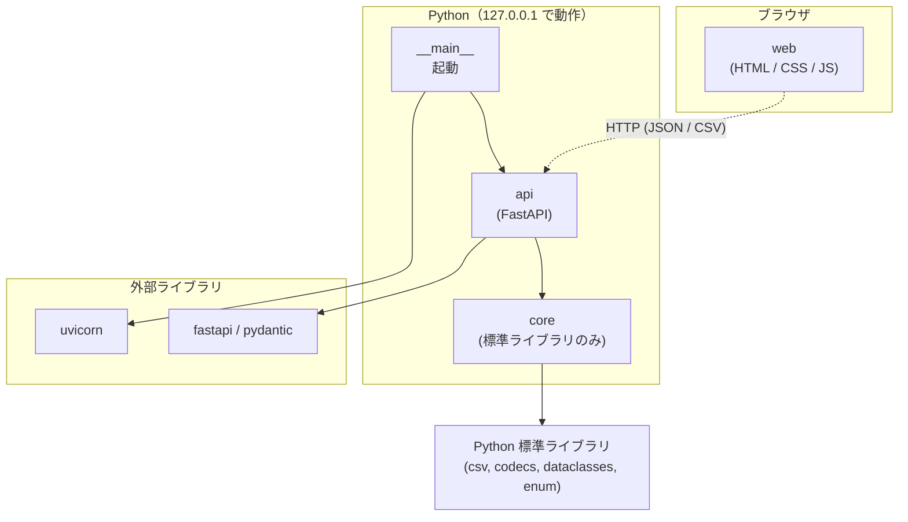

### 6.1 コア内部の依存関係

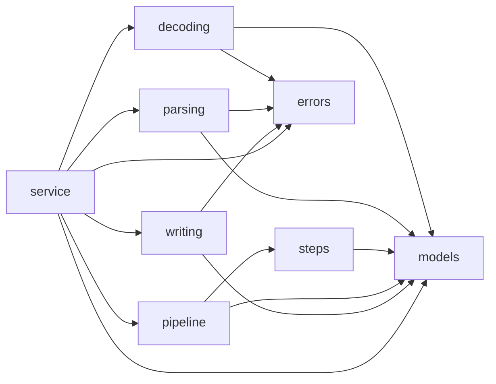

`models` と `errors` はどこからも使われるが、自分からは他のモジュールを使わない。これで循環する依存（A が B を使い、B も A を使う状態）を防ぐ。

### 6.2 画面内部の依存関係

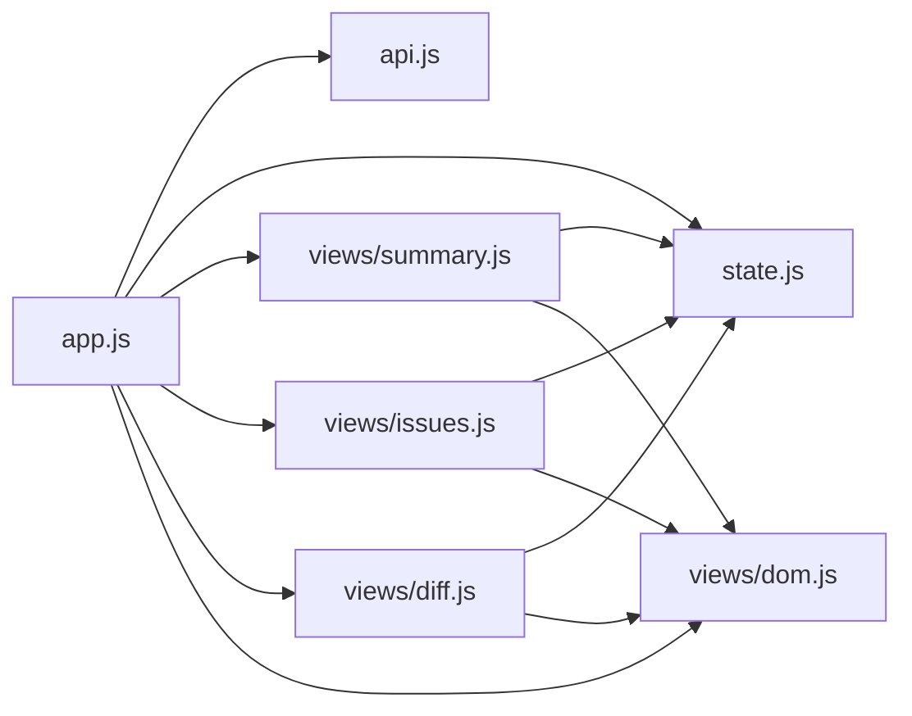

`views/dom.js` は作業9で追加した（14 章 I20）。

## 7. クラス図

### 7.1 コアのデータ型

`@dataclass`（Python でデータを入れる型を簡単に作る仕組み）と `Enum`（決まった値だけを取る型）で表す。

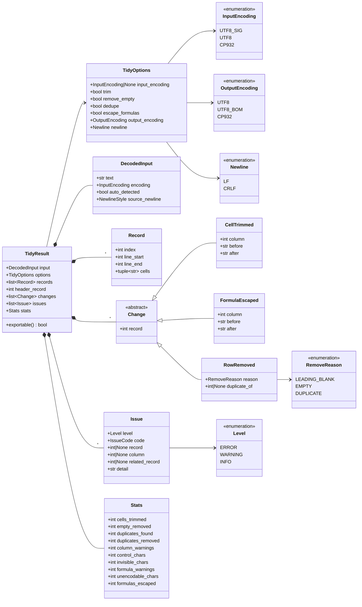

- `Record.cells` は読み込んだままの値を持つ。整形後の値は `Change` を当てはめて求める。`CellTrimmed` と `FormulaEscaped` は変更後の値（`after`）そのものを持つため、画面側は値を差し替えるだけで済み、計算をやり直さない。変更前と変更後の表を両方持たないことで、送るデータの量をおよそ半分にする。
- `Record.line_start` と `line_end` は元ファイルでの行番号。複数行にまたがるセルがあると、この2つが異なる。
- `exportable()` は、レベルが ERROR の課題（CP932 で表せない文字など）がないときに真を返す。
- `NewlineStyle` は元ファイルで行の区切りに使われていた改行コード（`LF`・`CRLF`・`CR`・混在 `MIXED`・改行なし `NONE`）を表す列挙型。クォートで囲まれたセルの中の改行は数えない。画面上部の「変換元 → 変換先」の表示（FR-47）に使う。図が大きくなるため省略した。
- `IssueCode` は課題の種類（列数の不一致、制御文字、見えない文字、複数行セル、数式化、CP932 で表せない文字、先頭の空行、データ行なし、重複あり）を表す列挙型。図が大きくなるため省略した。

### 7.2 処理と例外

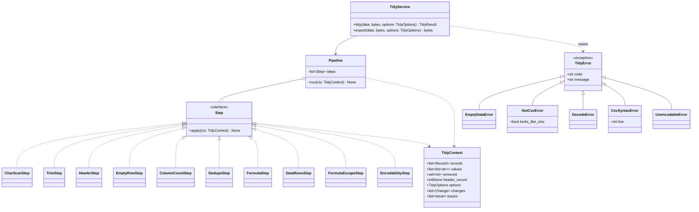

- 各処理（Step）は同じ形（`apply` を1つ持つ）にそろえる。処理の追加（v0.2 の列の操作、v0.3 の値の正規化）は Step を増やすだけで済む。
- `TidyContext.values` は処理中の値（トリム後の値など）を持つ作業用の領域。処理が終わると `TidyResult` に変換して捨てる。
- ファイルサイズの検査は API 側で行うため、コアには例外を用意しない。

### 7.3 依存の向きを確かめるテスト

`tests/test_dependencies.py` で、`core` 配下のすべてのファイルを読み、`fastapi`・`pydantic`・`csv_tidy.api` を import（他のモジュールを読み込むこと）していないことを確かめる。依存の向きが崩れたらテストが失敗する。

## 8. シーケンス図

### 8.1 読み込みと整形結果の表示

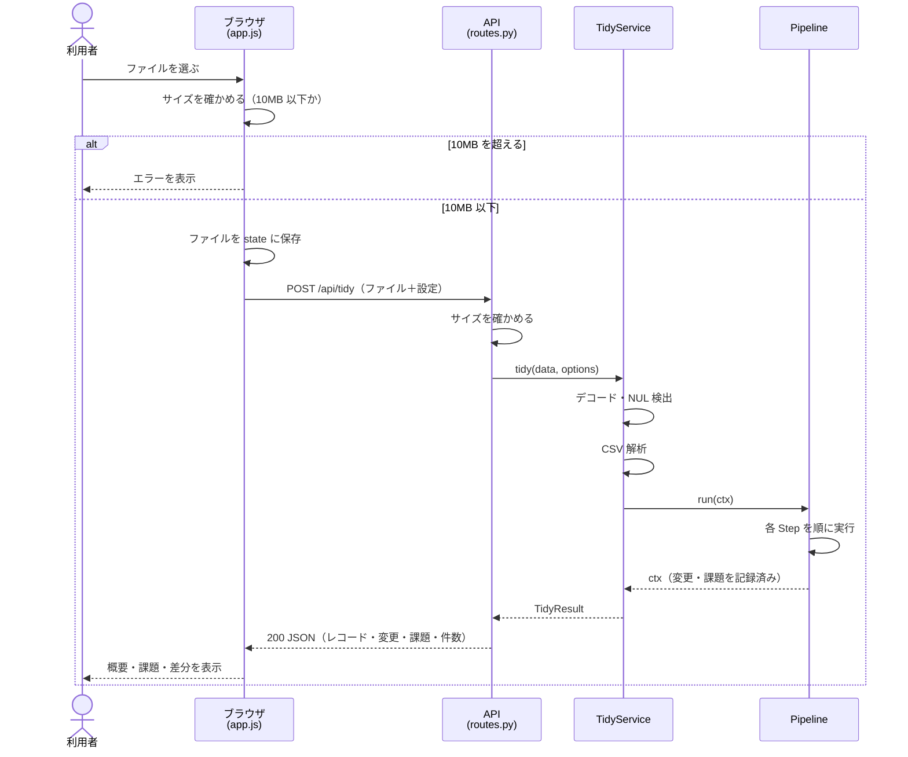

### 8.2 設定の変更（文字コードの指定し直しを含む）

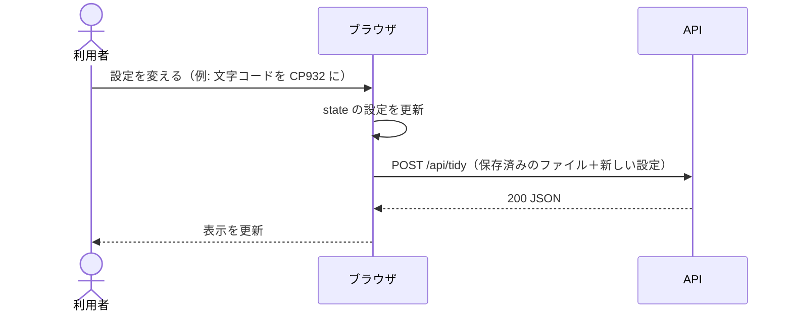

サーバーは前回の結果を持っていないため、ファイルごと送り直して最初から処理する（NFR-08）。

### 8.3 ダウンロード

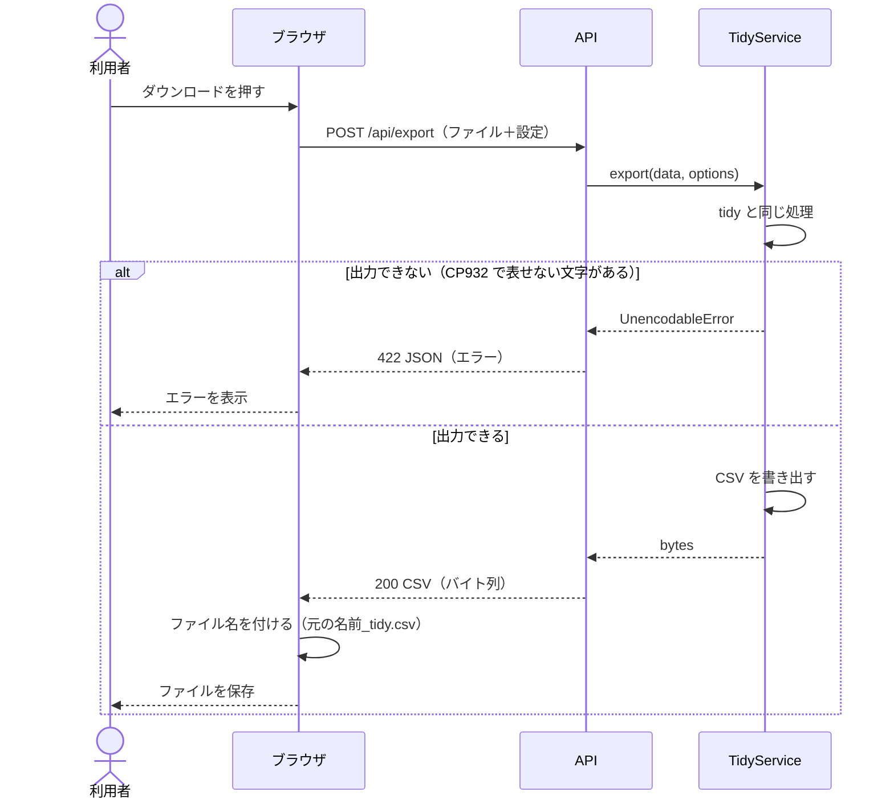

### 8.4 処理を中止するエラー

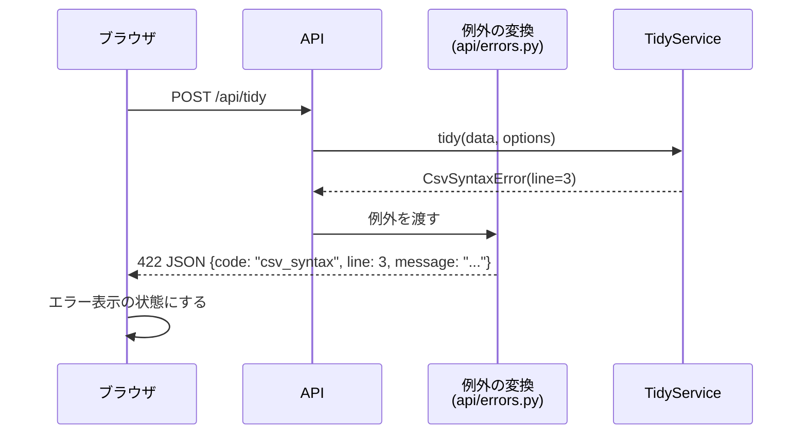

## 9. アクティビティ図（整形処理の流れ）

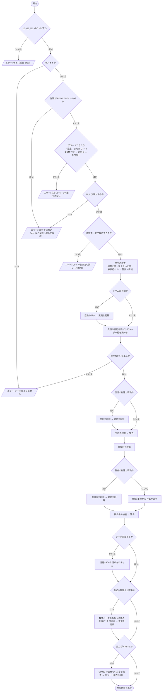

ダウンロード（`/api/export`）は、この流れの最後に「出力できるか確かめ、CSV を書き出す」を加えたものになる。

## 10. 状態遷移図

### 10.1 CSV 解析の状態

Python の `csv` モジュールを厳密モード（`strict=True`）で使ったときの動きを、1つのセルを読む範囲で表す。自分で解析処理を書くのではなく、この動きを前提にテストを書く。

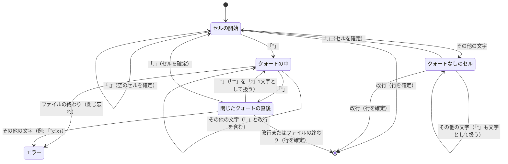

「クォートなしのセル」の中の `"` がエラーにならない点（例: `a,b"c`）は、課題管理 H2 で確認した動きである。

### 10.2 画面の状態

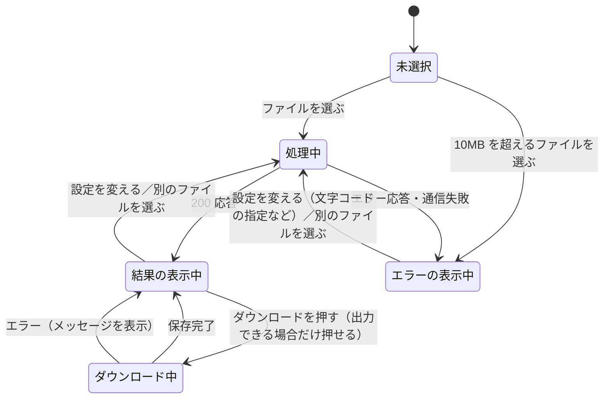

- 「結果の表示中」でも、CP932 で表せない文字があるときはダウンロードのボタンを押せないようにする（FR-16）。
- 「エラーの表示中」から設定を変えられるようにするのは、文字コードの自動判定を誤って解析エラーになったときに、指定し直して回復できるようにするためである（FR-12）。

## 11. API 定義

| メソッド・パス | 役割 | リクエスト | 成功時の応答 |
| --- | --- | --- | --- |
| `GET /` | 画面を返す | なし | `index.html` |
| `GET /static/...` | JS・CSS を返す | なし | 静的ファイル |
| `POST /api/tidy` | 整形結果を返す | `multipart/form-data`（ファイルと文字データを一緒に送る形式）: `file`（CSV）、`options`（設定の JSON 文字列） | 200、JSON（11.2） |
| `POST /api/export` | 整形後の CSV を返す | `/api/tidy` と同じ | 200、CSV のバイト列。保存するファイル名は画面側で付ける（13 章 D7） |

### 11.1 設定（options）

```json
{
  "input_encoding": null,
  "trim": true,
  "remove_empty": true,
  "dedupe": false,
  "escape_formulas": true,
  "output_encoding": "utf-8",
  "newline": "lf"
}
```

- `input_encoding`: `null`（自動判定）、`"utf-8-sig"`、`"utf-8"`、`"cp932"`
- `output_encoding`: `"utf-8"`、`"utf-8-bom"`、`"cp932"`
- `newline`: `"lf"`、`"crlf"`
- 上の例は初期状態の値。`trim` と `remove_empty` は `true`、`dedupe` は `false`（FR-22）、`escape_formulas` は `true`（FR-49）

### 11.2 整形結果（`POST /api/tidy` の応答）

```json
{
  "input": { "encoding": "cp932", "auto_detected": true, "newline": "crlf", "size": 1234 },
  "output": { "encoding": "utf-8", "newline": "lf", "exportable": true },
  "header_record": 0,
  "records": [
    { "index": 0, "line_start": 1, "line_end": 1, "cells": ["名前", "年齢"] },
    { "index": 1, "line_start": 2, "line_end": 2, "cells": ["  山田　", "30"] },
    { "index": 2, "line_start": 3, "line_end": 3, "cells": ["山田", "30"] }
  ],
  "changes": [
    { "type": "cell_trimmed", "record": 1, "column": 0, "after": "山田" },
    { "type": "row_removed", "record": 2, "reason": "duplicate", "duplicate_of": 1 }
  ],
  "issues": [
    { "level": "warning", "code": "column_count", "record": 5, "column": null, "related_record": null, "detail": "列数 2（ヘッダーは 3）" }
  ],
  "stats": { "cells_trimmed": 1, "empty_removed": 0, "duplicates_found": 1, "duplicates_removed": 1, "column_warnings": 1, "control_chars": 0, "invisible_chars": 0, "formula_warnings": 0, "unencodable_chars": 0 }
}
```

- この応答例は、`dedupe` を `true` にしたときのもの。
- 課題（`issues`）はすべて返し、「最初の 20 件」に絞るのは画面側で行う。
- 変更後の値は、画面側で `records` に `changes` を当てはめて求める。変更の種類（`type`）は `cell_trimmed`（空白を取り除いた）、`formula_escaped`（数式を無害化した。FR-49）、`row_removed`（行を削除した）の 3 つ。前の 2 つは `column` と `after` を持ち、画面は値を `after` に差し替える。

### 11.3 エラー応答

| HTTP ステータス | `code` | 場面 | 追加の項目 |
| --- | --- | --- | --- |
| 413 | `file_too_large` | 10,485,760 バイトを超える | `limit` |
| 422 | `empty_data` | 0 バイト、または空行だけ | なし |
| 422 | `not_csv` | NUL 文字を含む | `looks_like_xlsx` |
| 422 | `decode_failed` | どの文字コードでもデコードできない、または指定した文字コードで読めない | `encoding`（指定した文字コード。自動判定なら null） |
| 422 | `csv_syntax` | CSV の書き方の誤り | `line` |
| 422 | `unencodable` | `/api/export` で CP932 に出力できない | `count` |
| 422 | `invalid_options` | 設定の値が不正（JSON でない、知らない項目、値が選択肢にない） | `fields`（誤りのある項目名） |
| 422 | `invalid_request` | ファイルが送られていないなど、送られてきた形が正しくない | `fields` |

形は `{"error": {"code": "...", "message": "日本語のメッセージ", ...追加の項目}}` にそろえる。

## 12. 画面での安全対策

- セルの値は `textContent`（文字をそのまま文字として入れる方法）で画面に入れ、`innerHTML`（HTML として解釈させる方法）は使わない。これで HTML エスケープと同じ効果が得られる（NFR-07）。
- 見えない文字の記号表示（`[ZWSP]` など）も、文字の置き換えではなく、別の要素（`<span>`）を作って色を付けて示す。値そのものは変えない。

## 13. 設計上の判断と仮定

要件定義で直接決めていないため、設計の段階で置いた判断。D1・D2・D4 は 2026-10-01 のレビューで承認された。

| # | 判断 | 理由 | 他の案 |
| --- | --- | --- | --- |
| D1 | API を `/api/tidy`（表示用 JSON）と `/api/export`（CSV）の2つに分ける | 表示用の応答に出力ファイルを含めると、データ量がおよそ倍になる。ダウンロード時にもう一度処理しても 5 秒以内に収まる見込み | 1つの API で JSON と出力ファイル（base64 という文字への変換）を一緒に返す |
| D2 | 変更前の値と変更の記録だけを返し、変更後の値は画面側で組み立てる | 送るデータの量を抑えるため（変更前と変更後の表を両方送ると約2倍になる）。変更後の値はサーバーが整形の中で計算済みなので、サーバーの負荷を減らす目的ではない。変更の記録には変更後の値そのもの（`after`）を入れ、画面側は差し替えるだけにする。画面は JavaScript、出力は Python が作るため、画面側の不具合で食い違う可能性はゼロではないが、差し替えだけなので余地はごく小さい | 変更前と変更後の両方を返す |
| D3 | 各処理を同じ形の Step にそろえる | v0.2・v0.3 の機能追加が Step の追加で済む | 1つの関数に処理を順に書く |
| D4 | CSV 解析は Python の `csv` モジュールを使い、自分で書かない | 実績があり、状態遷移図 10.1 のとおり必要な検出ができる | 自前の状態機械で解析する（行番号の扱いは自由になるが、実装とテストの量が増える） |
| D5 | サイズの検査を画面と API の両方で行う | 画面側で先に止めて無駄な送信を避け、API 側でも必ず守る | API 側だけで行う |
| D6 | 依存の向きをテストで確かめる | 図と実装がずれないようにするため。追加のツールは使わない | import-linter などの専用ツールを使う |
| D7 | ダウンロードするファイルの名前はブラウザ側で付ける（JavaScript の `download` 属性） | ブラウザは元のファイル名を知っている。サーバー側で付けると、日本語の名前に `Content-Disposition` ヘッダーの特別な書き方（RFC 5987 形式）が必要になる | サーバーが `Content-Disposition` ヘッダーで名前を付ける |

## 14. 実装で決めたこと

実装の段階で決めた細部と、設計から変えた点を記録する。

| # | 作業 | 内容 | 理由 |
| --- | --- | --- | --- |
| I1 | 5 | xlsx（先頭が `PK\x03\x04`）かどうかを、文字コードの判定より**前**に確かめる。9章のアクティビティ図も直した | xlsx は文字列への変換に失敗することがあり、そうなると「文字コードを判定できない」という分かりにくいエラーになり、「CSV 形式で保存し直す」という案内が出ないため |
| I2 | 5 | 改行コードの判定（`NewlineStyle`）では、クォートで囲まれたセルの中の改行を数えない。改行が1つもない場合を `NONE` とした | 行の区切りは CRLF なのに、セルの中の LF だけで「混在」と表示されると誤解を招くため |
| I3 | 5 | ヘッダー行を決める処理は `parsing.find_header()`（すべてのセルが空の行を飛ばす）として作り、作業6の `HeaderStep` がトリム後の値を渡して使う | 空行の判定はトリムの有効・無効で変わる（FR-21）ため、トリムの後で呼ぶ必要がある |
| I4 | 5 | ファイルサイズの上限 `MAX_BYTES` はコアの `models.py` に置き、API もこれを使う | 上限の値を1か所で管理するため |
| I5 | 5 | 1つのセルの長さの上限は、`csv.field_size_limit()` を `MAX_BYTES` まで引き上げて対応した。この設定はプロセス全体に効く | csv モジュールに、解析1回ごとに上限を渡す方法がないため |
| I6 | 5 | Python の CP932 は 0x80 や 0xFD〜0xFF を別の文字（U+0080 や私用領域の文字）として読み、エラーにしない。このため「どの文字コードでも読めない」のは、2バイト文字の途中で切れているときなどに限られる | 実際に確かめた動き。文字化けの手がかりとしては、文字の検査（FR-18）の C1 制御文字の警告で補う |
| I7 | 6 | Step に `DataRowsStep`（ヘッダー行のほかにデータ行がなければ情報を出す）を追加した。7.2 のクラス図にも追加 | 「ヘッダーだけのファイル」の判定（FR-08）は、空行の削除の後でないとできないため、独立した段階にした |
| I8 | 6 | `Issue` に `related_record`（関係する別の行）を追加した。7.1 のクラス図にも追加 | 重複の情報で「何行目と同じか」を、画面が文章からではなくデータとして扱えるようにするため |
| I9 | 6 | 空行は、列数の検査と重複の検出の対象にしない（空行の削除をオフにしたときに残る空行を含む） | 空行は空行の削除（FR-21）で扱う。対象にすると「列数 0（ヘッダーは 4）」や空行どうしの重複が大量に出て、本当の問題が埋もれるため |
| I10 | 6 | 文字の検査（制御文字・見えない文字・複数行のセル）は、トリムの前の元の値に対して行う | トリムで消える位置にある文字も含めて、元のデータにある問題を知らせるため |
| I11 | 6 | 文字の検査は、まず行全体を 1 回の正規表現で調べ、該当する行だけをセルごとに調べる。数式化の検査は、値が変わった行だけを調べる | 10.4MB（10万行×10列）の試験データで、整形処理が 1.89 秒から 0.55 秒になった（読み込みを含めて 3.32 秒から 1.76 秒）。NFR-01（5 秒以内）に余裕を持たせるため |
| I12 | 7 | 出力ファイルは整形処理の作業用の値（`TidyContext.values`）から作り、画面に返す結果は元の値と変更の記録だけにする。元の値に変更の記録を当てはめる手順を `writing.replay_changes()` として用意し、出力と一致することをテスト P5 で確かめる | 設計判断 D2 の弱点（画面と出力の食い違い）を防ぐため。作り方が別々なので、一致すれば変更の記録に漏れがないことが分かる。画面の JavaScript はこの関数と同じ手順で組み立てる |
| I13 | 7 | `Stats` に `control_chars`・`invisible_chars`・`unencodable_chars` を追加した。7.1 のクラス図と 11.2 の応答例も更新 | 画面設計書 4.1 の概要で、見えない文字や CP932 で表せない文字の件数も表示するため |
| I14 | 7 | CP932 で表せない文字の件数は「1つのセルの中の同じ文字を 1 件」として数える。検査するのは出力する行（ヘッダーを含む）だけ | 削除した行は出力されないため。数え方は、作業6 の制御文字・見えない文字の課題とそろえた |
| I15 | 7 | 10.4MB の試験データで、整形結果（`tidy`）は約 1.4 秒、出力（`export`）は約 1.6〜1.9 秒 | 表示とダウンロードは別のリクエストなので、NFR-01（表示まで 5 秒以内）の対象は `tidy` の時間 |
| I16 | 8 | `/api/tidy` の JSON への変換に orjson（C 言語で書かれた速い JSON ライブラリ）を使う。依存ライブラリに追加した。コアからは使わない（依存の向きのテストで禁止） | 約 10MB（9万6千行）のファイルで応答は 17.6MiB になり、標準の json では変換に 0.7〜0.9 秒かかった。orjson では 0.02 秒で、出力の中身は同じ。`/api/tidy` 全体で 3.3〜3.8 秒から 1.9〜2.5 秒になり、NFR-01（5 秒以内）に画面の表示の時間を残せる |
| I17 | 8 | 開発用のライブラリを `httpx` から `httpx2` に替えた | FastAPI の土台の Starlette（1.7.0）が、TestClient で `httpx` を使うことを非推奨にし、`httpx2`（pydantic の公式リポジトリで配布）を求める警告を出すため |
| I18 | 8 | エラー応答に `invalid_request`（ファイルが送られていない、など）を追加した。11.3 の表も更新 | FastAPI が標準で返す形（`detail`）を、設計書の形（`error.code`・`error.message`）にそろえるため |
| I19 | 8 | `/api/export` は `Content-Disposition` を付けず、`Content-Type` で文字コードを伝える（CP932 は `windows-31j`） | 保存するファイル名は画面側で付ける（D7）。`windows-31j` は CP932 の IANA（インターネットの名前を管理する団体）での登録名 |
| I20 | 9 | 画面の部品を作る小さな道具 `views/dom.js`（`el()`）を追加した。文字は必ずテキストノード（`textContent` と同じ）で入れる。6.2 の図も更新 | 各画面の部品で同じ書き方をそろえ、`innerHTML` を使う余地をなくすため（NFR-07）。`.innerHTML` などを使っていないことは API のテストで確かめる |
| I21 | 9 | `GET /` の応答に CSP（画面が読み込んでよいものの出どころを限る仕組み）を付け、このサーバーから配信したスクリプト・スタイルだけを許す。`/static/` の応答には `Cache-Control: no-cache` を付ける | CSP は XSS の多重の守り（`textContent` が第一の守り）。`no-cache` は、更新した JavaScript の代わりに古いものが使われないようにするため |
| I22 | 9 | 「変更箇所のみ」も 100 項目（行と省略の行）ずつのページに分ける | 空白を取り除くセルが全行にあるような大きなファイルでは、「変更箇所のみ」でも数万行になり、画面が重くなるため（FR-44） |
| I23 | 9 | 差分の表では、見出しの行（`th`）にヘッダーの値を列の名前として出し、ヘッダー行そのものも 1 行目の行として表示する（帯に「ヘッダー行」と書く）。列数がヘッダーより多い行があるときは、表の列をいちばん多い列数に合わせ、見出しを「（N 列目）」にする | ヘッダー行もトリムの対象（FR-23）なので、その変更を他の行と同じように見せるため |
| I24 | 9 | 変更後の表の行番号は、出力するファイルでの行番号にする。セルの中の改行も出力されるので、その分だけ行番号を進める | 出力したファイルを開いたときの行番号と一致させるため（画面設計書 4.3） |
| I25 | 9 | セルが 1 つもない行（中身のない行）は「セルなし」にせず、空欄で表示する | 空行がすべて斜線になると、列数が足りないセル（FR-45）との区別がかえって付きにくいため |
| I26 | 9 | CP932 で表せない文字を差分で囲むとき、どの文字かは課題の `detail` に書かれた `U+XXXX` から取り出す。取り出せないときもセル全体は赤い枠で囲む | API の課題に文字そのものの項目がないため。`detail` の書き方を変えるときは、この処理も直す必要がある（弱点として記録する） |
| I27 | 9 | 課題の一覧の「さらに表示」は、1 回押すごとに 100 件ずつ増やす | 課題が数万件あるときに、一度にすべてを作ると画面が重くなるため（画面設計書 4.4 の「21 件目以降」を段階的に表示する） |
| I28 | 9 | 設定を変えて処理し直しても、見ていたタブと表示の切り替え（変更箇所のみ・全行）は保つ。別のファイルを選んだときは初期の表示に戻す。ダウンロードできない状態になったときは課題タブを開く | 設定を変えながら結果を確かめる使い方（画面設計書 1 章）で、毎回表示が戻ると比べにくいため |
| I29 | 9 | 処理中に設定を変えたときは、前の通信を `AbortController`（ブラウザの通信を途中で打ち切る仕組み）で打ち切る。表示とダウンロードには、その結果を求めたときの設定を使う | 最後の操作の結果だけを表示するため（画面設計書 5 章）。処理中に設定が変わっても、画面に出ている結果とダウンロードの中身が食い違わないようにする |
| I30 | 10 | 差分の表の 1 列の最小の幅を 96px から 72px に、行番号の欄を 72px から 88px にした | 受け入れテストの手動確認 M3 で、画面設計の前提の幅 1280px では 4 列目が切れていたため。行番号の欄は「812〜813」のような複数行の行番号が切れていたため |
| I31 | 10 | 変更の帯の中は、削除・課題のバッジを先に、「空白を取り除いた（N セル）」の説明を最後に並べる | 手動確認 M4 で、帯（180px）に収まらないときに「数式になる値」などのバッジが隠れていたため。すべての内容はマウスを重ねると読める |
| I32 | 10 | E2E と性能測定で共通のフィクスチャ（テスト用のサーバーの起動など）を `tests/browser_fixtures.py` にまとめ、それぞれの conftest.py から読み込む | 性能測定でも、画面の表示までの時間を Playwright で測るため |
| I33 | 12 | 数式の無害化（FR-49）を `FormulaEscapeStep` として、数式化の検査（`FormulaStep`）と `DataRowsStep` の後、CP932 の検査（`EncodabilityStep`）の前に置いた。変更は `FormulaEscaped`（`before`・`after` を持つ）として記録し、API では `formula_escaped` として返す。7.1・7.2 のクラス図と 9 章のアクティビティ図も更新 | 数式化の検査は無害化の前の値で行う必要がある（`'` が付くと数式のように見えなくなる）。CP932 の検査は、出力する最終の値に対して行うため最後に置く |
| I34 | 12 | 変更の記録を当てはめる手順（`writing.replay_changes()` と画面の `replayChanges()`）は、「行の削除以外の変更は、`after` に差し替える」という形にした | 変更の種類が増えても、当てはめ方を変えずに済むようにするため。出力との一致はテスト P5 と E2E で確かめている |
| I35 | 12 | 「数値として読める値」は、符号・半角数字・小数点・指数だけからなる値とし、正規表現の `\d` ではなく `[0-9]` で判定する | Python の `\d` は全角の数字（`５` など）にも当たる。全角の `－５` は数値として読めないことがあるため、無害化の対象に残す |

## 15. v0.2 の設計（列の操作）

要件は要件定義書 4.7 節（FR-60〜69）、画面は画面設計書 7 章と 4.3 節。開発計画の作業16 で決めた（2026-10-06）。v0.1 の考え方（コアは標準ライブラリだけ、サーバーは状態を持たない、変更は記録して返す）はそのまま引き継ぐ。

### 15.1 設定（options）の追加

```json
{
  "columns": [
    { "source": 0, "name": null, "keep": true, "compare": false },
    { "source": 1, "name": "氏名", "keep": true, "compare": true },
    { "source": 4, "name": null, "keep": true, "compare": true },
    { "source": 3, "name": null, "keep": true, "compare": true },
    { "source": 2, "name": null, "keep": false, "compare": false },
    { "source": 5, "name": null, "keep": true, "compare": true }
  ],
  "tidy_names": true
}
```

| 項目 | 意味 | 初期値 |
| --- | --- | --- |
| `columns` | 列の一覧の最終形（画面設計書 7.2）。配列の順番が出力の順番 | `null`（読み込んだときの状態。全列を元の順番・元の名前で出力し、すべて比べる） |
| `columns[].source` | 元の何列目か（0 から数える）。ヘッダーにない列も含む | ― |
| `columns[].name` | 出力する列名。`null` なら元のヘッダーの値（空白を取り除いた後の値。ヘッダーにない列は空） | `null` |
| `columns[].keep` | 出力するか（FR-61） | `true` |
| `columns[].compare` | 重複の判定に使うか（FR-65） | `keep` と同じ |
| `tidy_names` | 列名を整える（FR-66） | `true` |

- `columns` を指定するときは、`source` に 0 から列数−1 までがちょうど 1 回ずつ現れること（列の並べ替えであること）を求める。満たさないときは 422 `invalid_options`（`fields: ["columns"]`）にする。画面は、別のファイルを選んだら `columns` を `null` に戻す（FR-64）。
- 列数（`width`）は、ヘッダーと全データ行のうち最も多い列数（FR-60）。整形結果で返す（15.4）。

### 15.2 処理の順番（Step）

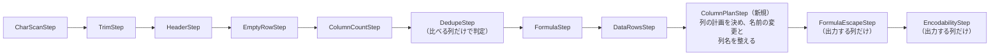

| Step | v0.2 で変えること |
| --- | --- |
| `DedupeStep` | 比べるキーを「比べる列の値」にする。行ごとに、比べる列それぞれについて、セルがあればその値、なければ「セルなし」を表す値を並べたものをキーにする（セルなしと空のセルを区別する。FR-65）。比べる列が 1 つもなければ何もしない。初期状態（全列を比べる）では v0.1 と同じ判定になる |
| `ColumnPlanStep`（新規） | `columns` から列の計画（出力する列の並び）を決めて `ctx.plan` に置く。出力する列の名前を決め、元の名前と違えば `HeaderRenamed`（理由 `renamed`）を記録する。`tidy_names` がオンなら FR-66 の順（改行→空→重複）で直し、直した列ごとに `HeaderRenamed`（理由 `tidied`）を記録する。オフなら、あるべき姿でない名前を課題 `header_name`（警告）にする |
| `FormulaEscapeStep` | 出力する行のうち、出力する列のセルだけを対象にする（FR-67） |
| `EncodabilityStep` | 同上 |

文字の検査（`CharScanStep`）、列数の検査（`ColumnCountStep`）、数式化の検査（`FormulaStep`）は、v0.1 と同じくすべての列を対象にする。

### 15.3 データ型の追加

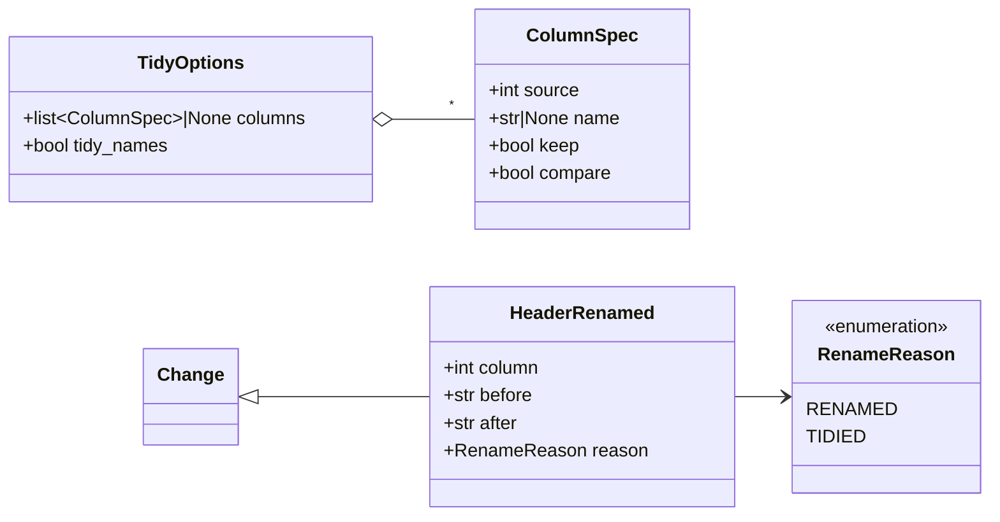

- `HeaderRenamed` は、ヘッダー行（`record` はヘッダーの Record.index）のセル `column`（元の何列目か）の値を `after` に変えた記録。ヘッダーにない列の名前を決めたときも、ヘッダー行のその位置のセルとして記録する（`before` は空）。
- 列の計画（出力する列の `source` の並び）は、整形結果にも入れる（15.4）。
- `IssueCode` に `header_name`（列名が空・重複・改行を含む。`tidy_names` がオフのとき）を加える。
- `Stats` に `header_names_tidied`（整えた列名の数）を加える。

### 15.4 整形結果（API の応答）の追加

```json
{
  "width": 6,
  "columns": [
    { "source": 0, "keep": true, "compare": false },
    { "source": 1, "keep": true, "compare": true }
  ],
  "changes": [
    { "type": "header_renamed", "record": 0, "column": 1, "after": "氏名", "reason": "renamed" },
    { "type": "header_renamed", "record": 0, "column": 5, "after": "列6", "reason": "tidied" }
  ]
}
```

- `columns` は、実際に使った列の計画（`options.columns` が `null` なら初期状態の計画）。画面はこれで右の表の列の並びと、課題の「（出力しない列）」を決める。
- 重複の組（画面設計書 4.3）は、v0.1 と同じ課題 `duplicate` の `related_record` と、行の削除 `row_removed` の `duplicate_of` から画面で組み立てる。API には追加しない。

### 15.5 変更の記録を当てはめる手順（D2・I12・I34 の拡張）

画面の `replayChanges()` と、コアの `writing.replay_changes()` を次の手順にそろえる。出力との一致はテスト P5 で確かめる（テスト計画書 12 章）。

1. 元の値に、行の削除以外の変更（`cell_trimmed`・`header_renamed`・`formula_escaped`）を記録の順に当てはめる。セルの位置が行の長さを超えるとき（ヘッダーにない列の名前など）は、その位置まで空のセルを足してから値を入れる。
2. 削除した行を除く。
3. 各行を、列の計画の出力する列の順に並べ直す。セルがない位置は空のセルにする。ただし、行の末尾に続くセルがない位置は出力しない（作業16 の開発者の決定）。

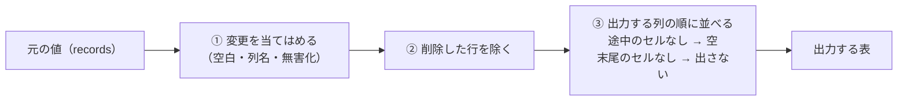

- 3 の決まりにより、列の操作をしないとき（初期状態）の出力は v0.1 と同じになる（受け入れ基準 29）。
- 途中のセルなしを空にしたセルは、画面の差分で「セルなし → 空として出力」と示す（右の表の該当セルを斜線ではなく空で示し、マウスを重ねると説明を出す）。

### 15.6 画面の用語の説明（「？」）

画面の専門用語に「？」を付け、押すと短い説明を出す（2026-10-06 の開発者の決定。画面設計書 11 章）。

| 項目 | 設計 |
| --- | --- |
| 説明の置き場所 | `web/help.js` に用語ごとの説明をまとめて持つ（`{ 用語のキー: { title, what, why } }`）。画面の各所は、キーを指定して同じ説明を使う |
| 部品 | `views/dom.js` に `helpButton(key)` を加える。「？」のボタンを作り、押すとその場に吹き出しを出す。文字は `textContent` で入れる（NFR-07） |
| 動き | 吹き出しは一度に 1 つだけ。もう一度押す、Esc キー、吹き出しの外を押すと閉じる。ボタンには `aria-expanded` と `aria-controls` を付け、画面読み上げソフトに開閉を伝える |
| 書き方の決まり | `title`: 画面に出ている用語。`what`: 何か（40 字まで）。`why`: なぜ困るか・どうするか（60 字まで）。正式な名前や番号（U+200B など）は `what` の後ろに括弧で添える |

v0.1 の画面にある用語の一覧（作業18 で説明を書いて入れる）:

| キー | 画面の用語 | 出る場所 |
| --- | --- | --- |
| `invisible_char` | 見えない文字 | 概要の件数、変更の帯、課題の一覧 |
| `control_char` | 制御文字 | 同上 |
| `nbsp` | NBSP | 整形の「空白を取り除く」の補足 |
| `bom` | BOM 付き | 読み込み・出力の文字コード |
| `cp932` | CP932 | 同上、ダウンロードできない理由 |
| `newline` | LF・CRLF | 出力の改行コード、概要 |
| `missing_cell` | セルなし | 差分の凡例 |
| `multiline_cell` | 複数行のセル | 変更の帯、課題の一覧 |
| `column_count` | 列数の警告 | 概要の件数、課題の一覧 |
| `formula_like` | 数式になる値・数式化の警告 | 同上 |
| `formula_escape` | 数式の無害化 | 出力の欄、概要の件数 |
| `duplicate` | 重複・重複の元 | 整形の欄、変更の帯、課題の一覧 |

v0.2 で加える用語（同じく作業18）: `compare`（比べる・重複の判定）、`tidy_names`（列名を整える）、`headerless`（ヘッダーなし）、`not_output`（出力しない列）。

### 15.7 v0.2 で決めた細部

| # | 内容 | 理由 |
| --- | --- | --- |
| V1 | 列の操作は、セルの値を変える記録ではなく、出力の最後に「列の計画で並べ直す」手順として扱う。列名の変更だけは、ヘッダー行のセルの変更（`HeaderRenamed`）として記録する | 列の並べ替えをセルごとの変更として記録すると、記録の量が行数×列数になる。並べ直しは計画 1 つで表せる |
| V2 | `columns` は、列の並べ替え（全列がちょうど 1 回ずつ）でなければ受け付けない | 画面の不具合で列が抜けたり重なったりしたまま出力するのを防ぐため。設定がファイルと合わないことにもすぐ気づける |
| V3 | 列を並べ替えた結果、行の途中に来た「セルなし」は空のセルとして出力し、末尾の「セルなし」は出力しない（開発者の決定） | 列の位置をずらさないため（詰めると値が別の列に入る）。列の操作をしないときは v0.1 と同じ出力になる |
| V4 | 数式化の警告（`FormulaStep`）は、v0.1 と同じくすべての列を対象にする。出力しない列の警告には、画面で「（出力しない列）」と添える | FR-67 で対象外にするのは、出力の内容を変える無害化と、出力を止める CP932 の検査だけのため |
| V5 | 重複の組の情報は API に加えず、画面で既存の `related_record`・`duplicate_of` から組み立てる | 必要な情報はすでに返している。応答を大きくしない |
