# csv-tidy 設計書

- 版: 第2版
- 作成日: 2026-09-28
- 対象リリース: v0.1（MVP）
- 前提: [requirements.md](requirements.md)（第6版）
- 用語: 分からない用語は [glossary.md](glossary.md) を参照
- 画面: [screen-design.md](screen-design.md)（画面の配置・要素・状態ごとの表示）
- テスト: [test-plan.md](test-plan.md)

図は Mermaid（文字で図を書く記法。GitHub 上ではそのまま図として表示される）で書く。
Mermaid にはユースケース図とパッケージ図の専用の記法がないため、この2つとアクティビティ図はフローチャートの記法で代用する。

## 1. 設計方針

| 方針 | 内容 | 関連する要件 |
| --- | --- | --- |
| コアを Web から切り離す | 整形処理（コア）は Python の標準ライブラリだけで書き、FastAPI に依存させない。API はコアを呼び出して結果を JSON に変換するだけにする | NFR-03 |
| 依存の向きは一方通行 | 画面 → API → コア の向きにだけ依存する。逆向きの依存（コアが API を知るなど）は作らない。テストで自動的に確かめる（7.3 節） | NFR-03 |
| コアをブラウザでも動かせる形に保つ | v0.4（候補）でコアを Pyodide で動かせるよう、コアはファイルの読み書き・ネットワーク・スレッド（処理を並行して動かす仕組み）など、ブラウザ内の Python で使えない機能に頼らない。入力はバイト列、出力は結果のデータとバイト列だけにする。この方針は v0.1 の設計に追加の手間をかけない | 要件定義書 3.1（v0.4）, issues.md Q2 |
| サーバーは状態を持たない | ファイルはブラウザが持ち、操作のたびにファイルと設定を送り直す。サーバーは毎回最初から処理する | NFR-08 |
| 変更は記録して返す | 差分を後から推測せず、各処理が「何を変えたか」を記録する | FR-41 |
| 変更の原則に従う | 変更するのは利用者が選んだ処理だけ、変更はすべて見せる、元のファイルは書き換えない。警告の対象になる値も書き換えず、問題は「課題（Issue）」として返して画面で知らせる | 要件定義書 1.1, FR-18, FR-31, FR-48 |

## 2. 技術構成

| 分類 | 採用 | 理由 |
| --- | --- | --- |
| 言語 | Python 3.11 以上 | NFR-06 |
| Web の窓口 | FastAPI ＋ uvicorn（FastAPI のアプリを動かすサーバー） | 要件定義で決定済み |
| ライブラリ管理 | uv | ロックファイルで環境を再現でき、起動も `uv run` の1コマンドで済む（NFR-05） |
| 画面 | HTML ＋ CSS ＋ 素の JavaScript（ES モジュール） | ビルドが不要で、FastAPI から静的ファイルとしてそのまま配信できる |
| テスト | pytest、FastAPI の TestClient | NFR-04 |
| 図 | Mermaid | GitHub 上でそのまま表示され、文字なので Git で差分を追える |

## 3. 機能一覧

| ID | 機能 | 概要 | 担当する層 | 関連する要件 |
| --- | --- | --- | --- | --- |
| F-01 | ファイル選択 | CSV ファイルを1つ選ぶ。サイズの上限を画面側でも先に確かめる | 画面 | FR-01, FR-02 |
| F-02 | サイズ検査 | 10,485,760 バイトを超えるファイルを拒否する | API | FR-02 |
| F-03 | 文字コード判定 | UTF-8（BOM 付き）→ UTF-8 → CP932 の順に試す。手動指定があればそれを使う | コア | FR-10〜13 |
| F-04 | CSV ではないファイルの検出 | NUL 文字があれば中止し、xlsx なら保存し直すよう案内する | コア | FR-17 |
| F-05 | CSV 解析 | 厳密モードで解析し、書き方の誤りを行番号付きで返す | コア | FR-03, FR-05, FR-06 |
| F-06 | 文字の検査 | 制御文字・見えない文字・複数行にまたがるセルを見つける | コア | FR-07, FR-18 |
| F-07 | 空白トリム | セル前後の決められた空白を取り除く | コア | FR-20 |
| F-08 | ヘッダー行の決定 | 先頭の空行を飛ばし、最初の空でない行をヘッダーにする。空ファイル・ヘッダーのみのファイルを判定する | コア | FR-04, FR-08 |
| F-09 | 空行の削除 | すべてのセルが空の行を削除する | コア | FR-21 |
| F-10 | 列数の検査 | ヘッダーと列数が違う行を警告する | コア | FR-30, FR-31 |
| F-11 | 重複行の検出と削除 | 列数と全セルが一致する行を検出する。削除が有効なとき（初期状態はオフ）だけ2件目以降を削除し、無効なときは情報として表示する | コア | FR-22 |
| F-12 | 数式化の検査 | 整形で先頭が `=` `+` `-` `@` になったセルを警告する | コア | FR-48 |
| F-13 | 出力文字コードの検査 | CP932 で表せない文字を見つけ、出力できない状態にする | コア | FR-16 |
| F-14 | CSV 書き出し | 選んだ文字コードと改行コードでバイト列にする | コア | FR-14, FR-15, FR-50 |
| F-15 | 整形結果の取得 | ファイルと設定を受け取り、整形結果を JSON で返す | API | NFR-08 |
| F-16 | ダウンロード用の出力 | ファイルと設定を受け取り、整形後の CSV を返す。保存するファイル名（`元の名前_tidy.csv`）はブラウザ側で付ける | API・画面 | FR-50 |
| F-17 | 概要と件数の表示 | 文字コード・改行コードの変換内容と変更件数を表示する | 画面 | FR-46, FR-47 |
| F-18 | 課題の一覧表示 | エラー・警告・情報を、種類ごとに件数と最初の 20 件で表示する | 画面 | FR-16, FR-18 |
| F-19 | 差分表示 | 変更前後を左右に並べ、「変更箇所のみ」と「全行」を切り替える。見えない文字は記号で示す | 画面 | FR-42〜45, FR-18 |
| F-20 | 設定の変更 | 文字コードの手動指定と各処理のオン・オフを変え、処理し直す | 画面 | FR-12, 4.3 節 |

## 4. ユースケース図

利用者（アクター＝システムを使う人）ができることを示す。

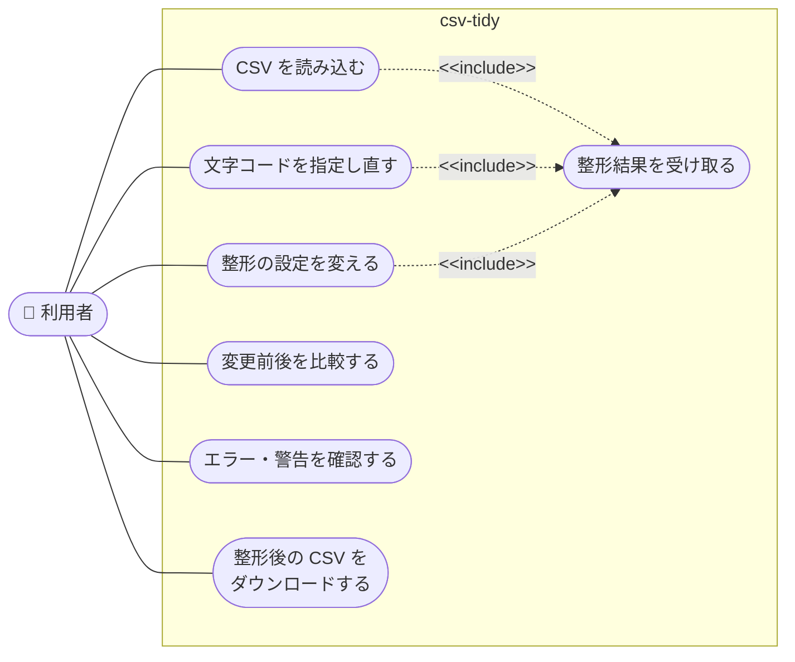

`<<include>>` は「そのユースケースを実行すると、必ずこのユースケースも実行される」という関係を表す。ファイルの読み込み・文字コードの指定し直し・設定の変更は、いずれもサーバーに送り直して整形結果を受け取る（NFR-08）。

## 5. ディレクトリ構成

```text
csv-tidy/
├── pyproject.toml          # プロジェクトの設定と依存ライブラリ（uv が使う）
├── uv.lock                 # 依存ライブラリの版を固定するロックファイル
├── README.md
├── CLAUDE.md
├── docs/                   # 要件定義・設計・課題・用語集
├── scripts/
│   └── gen_bench_data.py   # 性能測定用の 10MB の CSV を生成する（NFR-01）
├── src/csv_tidy/
│   ├── __init__.py
│   ├── __main__.py         # `uv run csv-tidy` で 127.0.0.1 にサーバーを起動する
│   ├── core/               # 整形処理のコア（標準ライブラリだけを使う）
│   │   ├── models.py       # 設定・レコード・変更・課題・結果のデータ型
│   │   ├── errors.py       # 処理を中止するときの例外
│   │   ├── decoding.py     # 文字コード判定とデコード、NUL の検出
│   │   ├── parsing.py      # CSV 解析
│   │   ├── steps.py        # 各整形処理（トリム・空行削除など）
│   │   ├── pipeline.py     # 処理を順番に実行する
│   │   ├── writing.py      # CSV の書き出し
│   │   └── service.py      # コアの入口（API はこれだけを呼ぶ）
│   ├── api/                # FastAPI による Web の窓口
│   │   ├── app.py          # アプリの組み立てと静的ファイルの配信
│   │   ├── routes.py       # エンドポイント（API の各窓口）
│   │   ├── schemas.py      # JSON の形の定義
│   │   └── errors.py       # 例外を HTTP のエラー応答に変換する
│   └── web/                # 画面（ブラウザで動く）
│       ├── index.html
│       ├── style.css
│       ├── app.js          # 入口。操作と処理を結びつける
│       ├── api.js          # サーバーとの通信
│       ├── state.js        # 画面の状態（ファイル・設定・結果）を持つ
│       └── views/
│           ├── summary.js  # 概要と件数
│           ├── issues.js   # 課題の一覧
│           └── diff.js     # 差分表示
└── tests/
    ├── core/               # コアのユニットテスト
    ├── api/                # API の結合テスト
    ├── test_dependencies.py # 依存の向きを確かめるテスト（7.3 節）
    └── fixtures/           # テスト用の CSV ファイル
```

## 6. パッケージ図（依存関係）

矢印は「使う側 → 使われる側」を表す。点線の矢印は HTTP 通信による利用を表す。

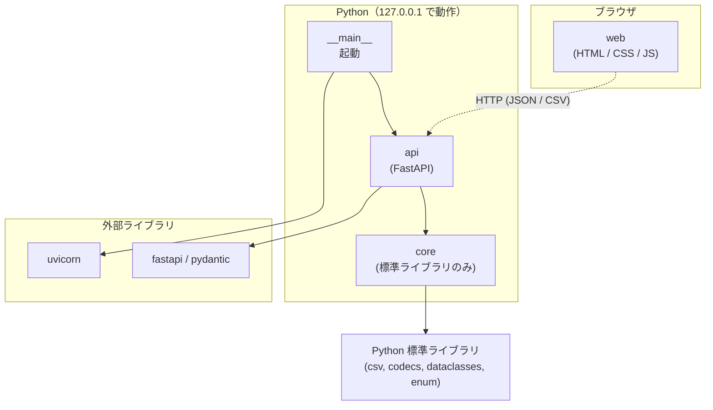

### 6.1 コア内部の依存関係

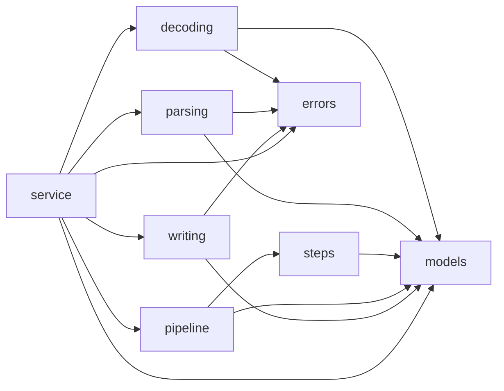

`models` と `errors` はどこからも使われるが、自分からは他のモジュールを使わない。これで循環する依存（A が B を使い、B も A を使う状態）を防ぐ。

### 6.2 画面内部の依存関係

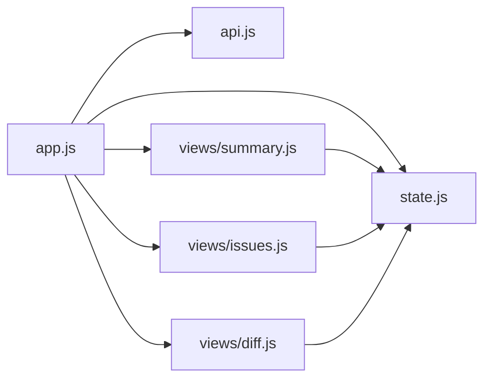

## 7. クラス図

### 7.1 コアのデータ型

`@dataclass`（Python でデータを入れる型を簡単に作る仕組み）と `Enum`（決まった値だけを取る型）で表す。

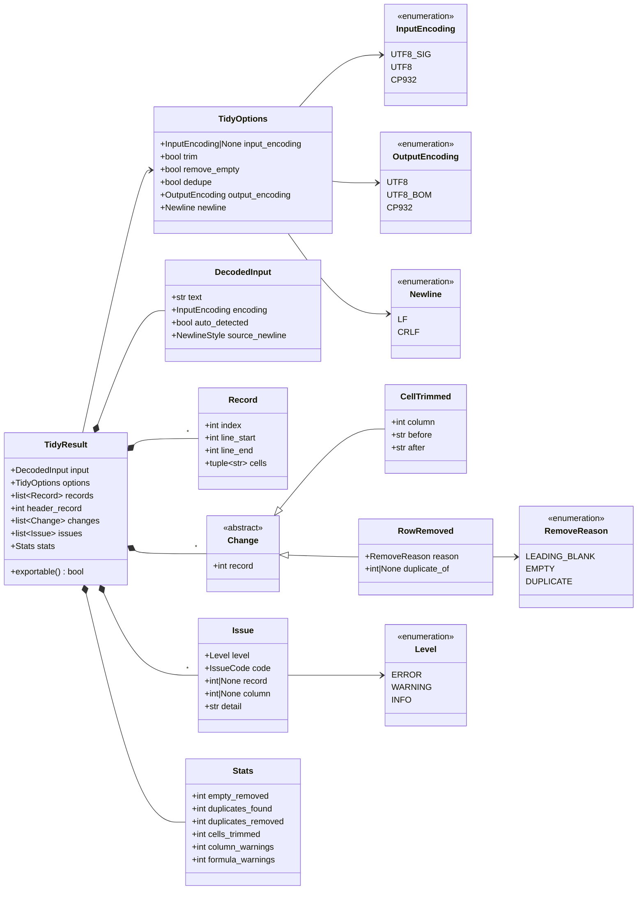

- `Record.cells` は読み込んだままの値を持つ。整形後の値は `Change` を当てはめて求める。`CellTrimmed` は変更後の値（`after`）そのものを持つため、画面側は値を差し替えるだけで済み、計算をやり直さない。変更前と変更後の表を両方持たないことで、送るデータの量をおよそ半分にする。
- `Record.line_start` と `line_end` は元ファイルでの行番号。複数行にまたがるセルがあると、この2つが異なる。
- `exportable()` は、レベルが ERROR の課題（CP932 で表せない文字など）がないときに真を返す。
- `NewlineStyle` は元ファイルで使われていた改行コード（`LF`・`CRLF`・`CR`・混在 `MIXED`）を表す列挙型。画面上部の「変換元 → 変換先」の表示（FR-47）に使う。図が大きくなるため省略した。
- `IssueCode` は課題の種類（列数の不一致、制御文字、見えない文字、複数行セル、数式化、CP932 で表せない文字、先頭の空行、データ行なし、重複あり）を表す列挙型。図が大きくなるため省略した。

### 7.2 処理と例外

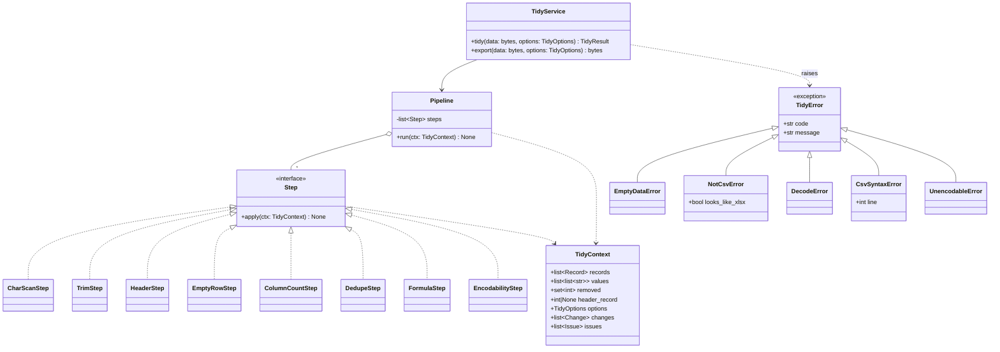

- 各処理（Step）は同じ形（`apply` を1つ持つ）にそろえる。処理の追加（v0.2 の列の操作、v0.3 の値の正規化）は Step を増やすだけで済む。
- `TidyContext.values` は処理中の値（トリム後の値など）を持つ作業用の領域。処理が終わると `TidyResult` に変換して捨てる。
- ファイルサイズの検査は API 側で行うため、コアには例外を用意しない。

### 7.3 依存の向きを確かめるテスト

`tests/test_dependencies.py` で、`core` 配下のすべてのファイルを読み、`fastapi`・`pydantic`・`csv_tidy.api` を import（他のモジュールを読み込むこと）していないことを確かめる。依存の向きが崩れたらテストが失敗する。

## 8. シーケンス図

### 8.1 読み込みと整形結果の表示

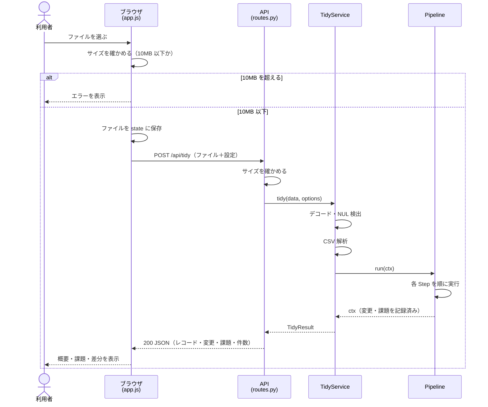

### 8.2 設定の変更（文字コードの指定し直しを含む）

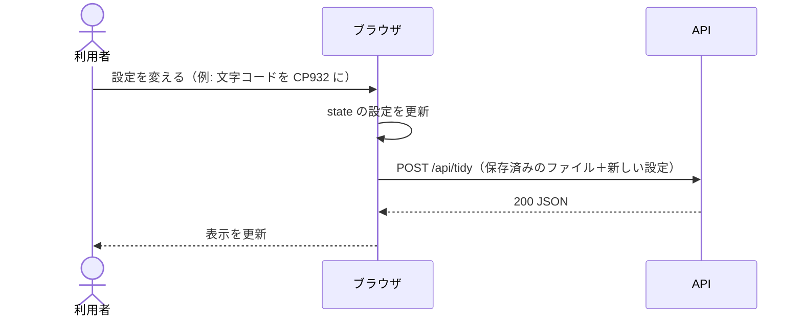

サーバーは前回の結果を持っていないため、ファイルごと送り直して最初から処理する（NFR-08）。

### 8.3 ダウンロード

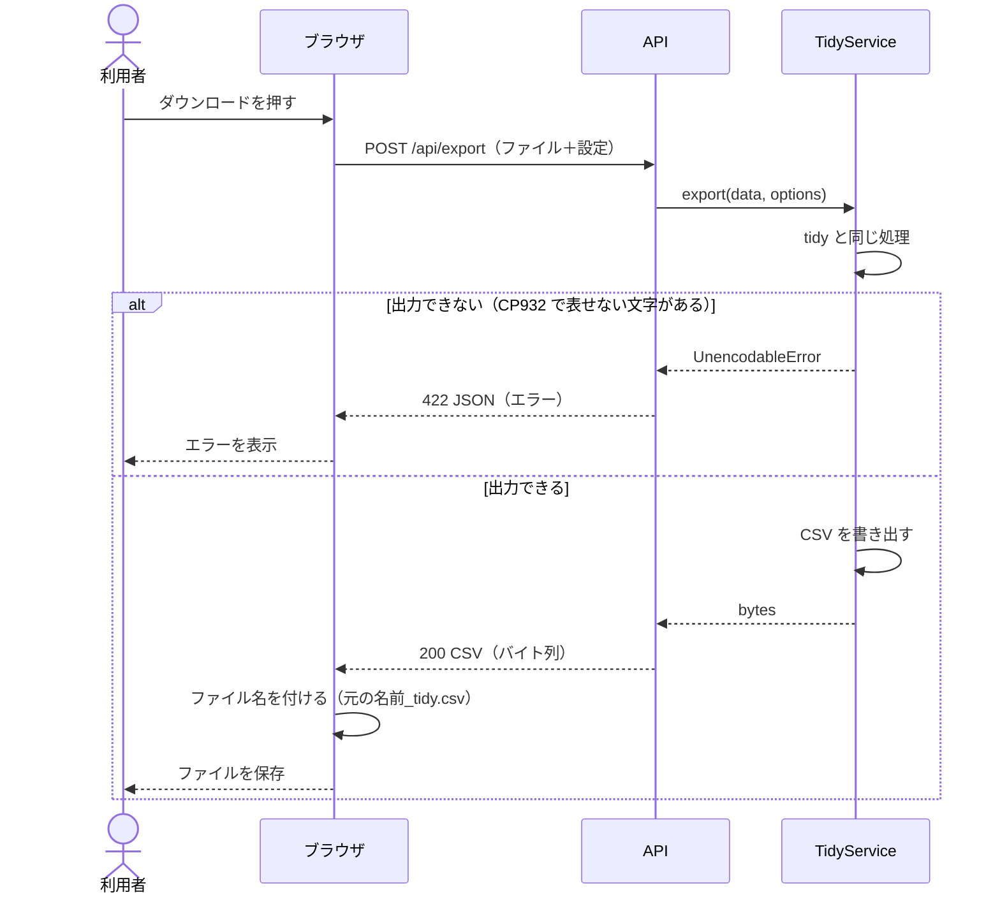

### 8.4 処理を中止するエラー

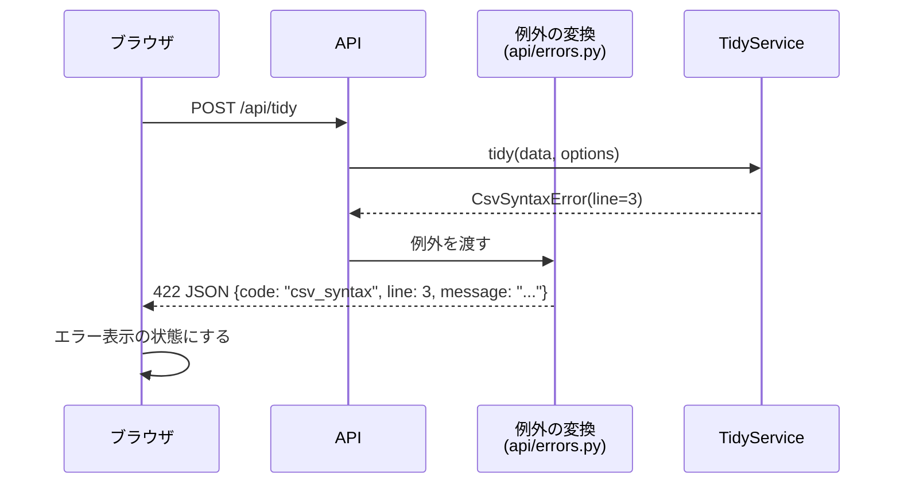

## 9. アクティビティ図（整形処理の流れ）

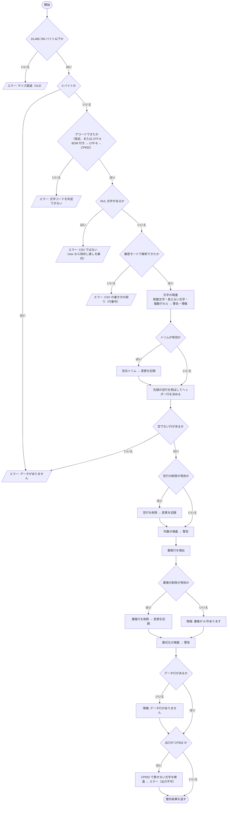

ダウンロード（`/api/export`）は、この流れの最後に「出力できるか確かめ、CSV を書き出す」を加えたものになる。

## 10. 状態遷移図

### 10.1 CSV 解析の状態

Python の `csv` モジュールを厳密モード（`strict=True`）で使ったときの動きを、1つのセルを読む範囲で表す。自分で解析処理を書くのではなく、この動きを前提にテストを書く。

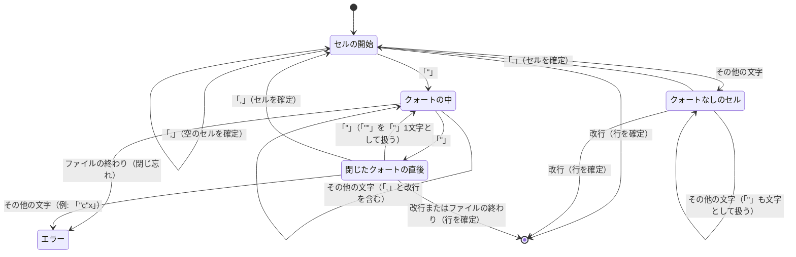

「クォートなしのセル」の中の `"` がエラーにならない点（例: `a,b"c`）は、課題管理 H2 で確認した動きである。

### 10.2 画面の状態

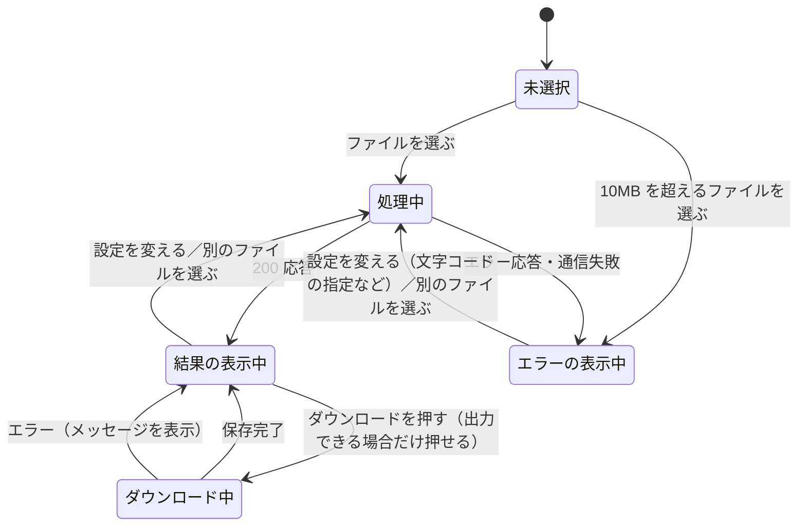

- 「結果の表示中」でも、CP932 で表せない文字があるときはダウンロードのボタンを押せないようにする（FR-16）。
- 「エラーの表示中」から設定を変えられるようにするのは、文字コードの自動判定を誤って解析エラーになったときに、指定し直して回復できるようにするためである（FR-12）。

## 11. API 定義

| メソッド・パス | 役割 | リクエスト | 成功時の応答 |
| --- | --- | --- | --- |
| `GET /` | 画面を返す | なし | `index.html` |
| `GET /static/...` | JS・CSS を返す | なし | 静的ファイル |
| `POST /api/tidy` | 整形結果を返す | `multipart/form-data`（ファイルと文字データを一緒に送る形式）: `file`（CSV）、`options`（設定の JSON 文字列） | 200、JSON（11.2） |
| `POST /api/export` | 整形後の CSV を返す | `/api/tidy` と同じ | 200、CSV のバイト列。保存するファイル名は画面側で付ける（13 章 D7） |

### 11.1 設定（options）

```json
{
  "input_encoding": null,
  "trim": true,
  "remove_empty": true,
  "dedupe": false,
  "output_encoding": "utf-8",
  "newline": "lf"
}
```

- `input_encoding`: `null`（自動判定）、`"utf-8-sig"`、`"utf-8"`、`"cp932"`
- `output_encoding`: `"utf-8"`、`"utf-8-bom"`、`"cp932"`
- `newline`: `"lf"`、`"crlf"`
- 上の例は初期状態の値。`trim` と `remove_empty` は `true`、`dedupe` は `false`（FR-22）

### 11.2 整形結果（`POST /api/tidy` の応答）

```json
{
  "input": { "encoding": "cp932", "auto_detected": true, "newline": "crlf", "size": 1234 },
  "output": { "encoding": "utf-8", "newline": "lf", "exportable": true },
  "header_record": 0,
  "records": [
    { "index": 0, "line_start": 1, "line_end": 1, "cells": ["名前", "年齢"] },
    { "index": 1, "line_start": 2, "line_end": 2, "cells": ["  山田　", "30"] },
    { "index": 2, "line_start": 3, "line_end": 3, "cells": ["山田", "30"] }
  ],
  "changes": [
    { "type": "cell_trimmed", "record": 1, "column": 0, "after": "山田" },
    { "type": "row_removed", "record": 2, "reason": "duplicate", "duplicate_of": 1 }
  ],
  "issues": [
    { "level": "warning", "code": "column_count", "record": 5, "column": null, "detail": "列数 2（ヘッダーは 3）" }
  ],
  "stats": { "empty_removed": 0, "duplicates_found": 1, "duplicates_removed": 1, "cells_trimmed": 1, "column_warnings": 1, "formula_warnings": 0 }
}
```

- この応答例は、`dedupe` を `true` にしたときのもの。
- 課題（`issues`）はすべて返し、「最初の 20 件」に絞るのは画面側で行う。
- 変更後の値は、画面側で `records` に `changes` を当てはめて求める。

### 11.3 エラー応答

| HTTP ステータス | `code` | 場面 | 追加の項目 |
| --- | --- | --- | --- |
| 413 | `file_too_large` | 10,485,760 バイトを超える | なし |
| 422 | `empty_data` | 0 バイト、または空行だけ | なし |
| 422 | `not_csv` | NUL 文字を含む | `looks_like_xlsx` |
| 422 | `decode_failed` | どの文字コードでもデコードできない | なし |
| 422 | `csv_syntax` | CSV の書き方の誤り | `line` |
| 422 | `unencodable` | `/api/export` で CP932 に出力できない | `count` |
| 422 | `invalid_options` | 設定の値が不正 | `detail` |

形は `{"error": {"code": "...", "message": "日本語のメッセージ", ...追加の項目}}` にそろえる。

## 12. 画面での安全対策

- セルの値は `textContent`（文字をそのまま文字として入れる方法）で画面に入れ、`innerHTML`（HTML として解釈させる方法）は使わない。これで HTML エスケープと同じ効果が得られる（NFR-07）。
- 見えない文字の記号表示（`[ZWSP]` など）も、文字の置き換えではなく、別の要素（`<span>`）を作って色を付けて示す。値そのものは変えない。

## 13. 設計上の判断と仮定

要件定義で直接決めていないため、設計の段階で置いた判断。D1・D2・D4 は 2026-10-01 のレビューで承認された。

| # | 判断 | 理由 | 他の案 |
| --- | --- | --- | --- |
| D1 | API を `/api/tidy`（表示用 JSON）と `/api/export`（CSV）の2つに分ける | 表示用の応答に出力ファイルを含めると、データ量がおよそ倍になる。ダウンロード時にもう一度処理しても 5 秒以内に収まる見込み | 1つの API で JSON と出力ファイル（base64 という文字への変換）を一緒に返す |
| D2 | 変更前の値と変更の記録だけを返し、変更後の値は画面側で組み立てる | 送るデータの量を抑えるため（変更前と変更後の表を両方送ると約2倍になる）。変更後の値はサーバーが整形の中で計算済みなので、サーバーの負荷を減らす目的ではない。変更の記録には変更後の値そのもの（`after`）を入れ、画面側は差し替えるだけにする。画面は JavaScript、出力は Python が作るため、画面側の不具合で食い違う可能性はゼロではないが、差し替えだけなので余地はごく小さい | 変更前と変更後の両方を返す |
| D3 | 各処理を同じ形の Step にそろえる | v0.2・v0.3 の機能追加が Step の追加で済む | 1つの関数に処理を順に書く |
| D4 | CSV 解析は Python の `csv` モジュールを使い、自分で書かない | 実績があり、状態遷移図 10.1 のとおり必要な検出ができる | 自前の状態機械で解析する（行番号の扱いは自由になるが、実装とテストの量が増える） |
| D5 | サイズの検査を画面と API の両方で行う | 画面側で先に止めて無駄な送信を避け、API 側でも必ず守る | API 側だけで行う |
| D6 | 依存の向きをテストで確かめる | 図と実装がずれないようにするため。追加のツールは使わない | import-linter などの専用ツールを使う |
| D7 | ダウンロードするファイルの名前はブラウザ側で付ける（JavaScript の `download` 属性） | ブラウザは元のファイル名を知っている。サーバー側で付けると、日本語の名前に `Content-Disposition` ヘッダーの特別な書き方（RFC 5987 形式）が必要になる | サーバーが `Content-Disposition` ヘッダーで名前を付ける |
