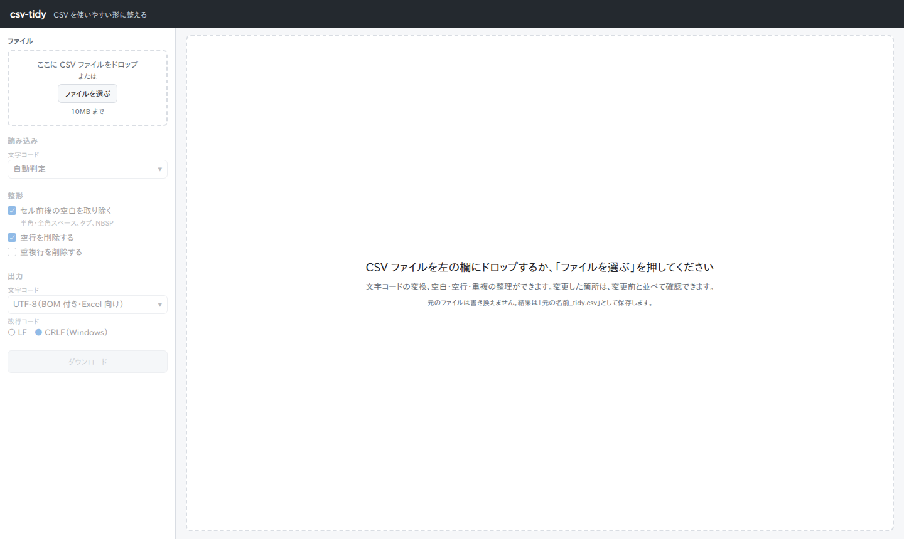
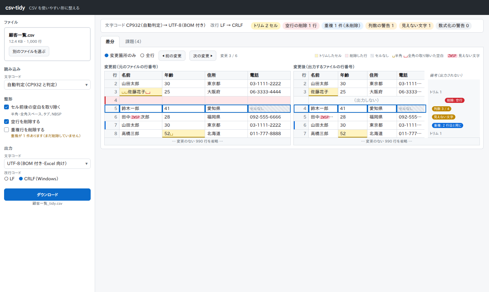
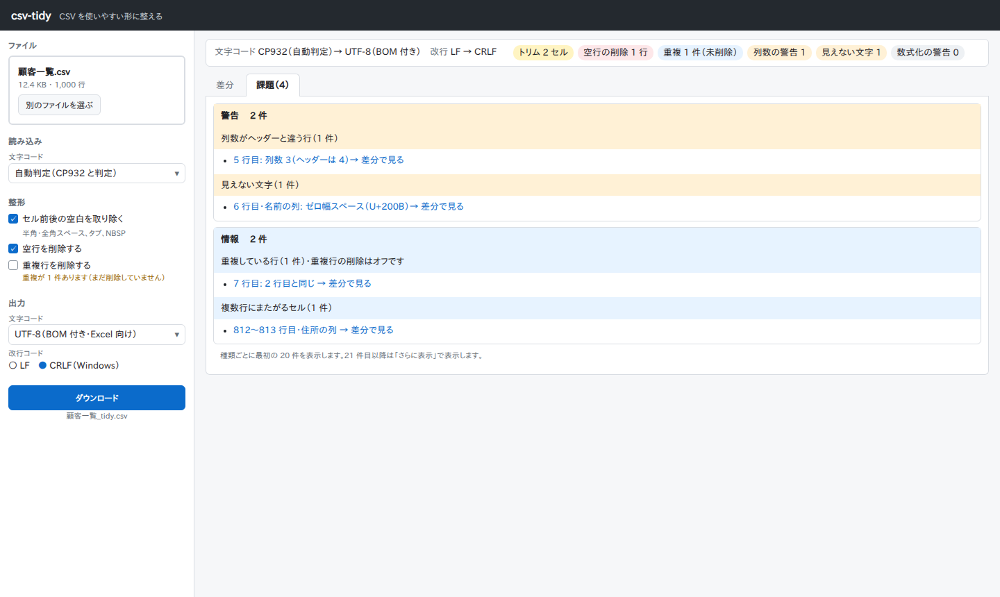
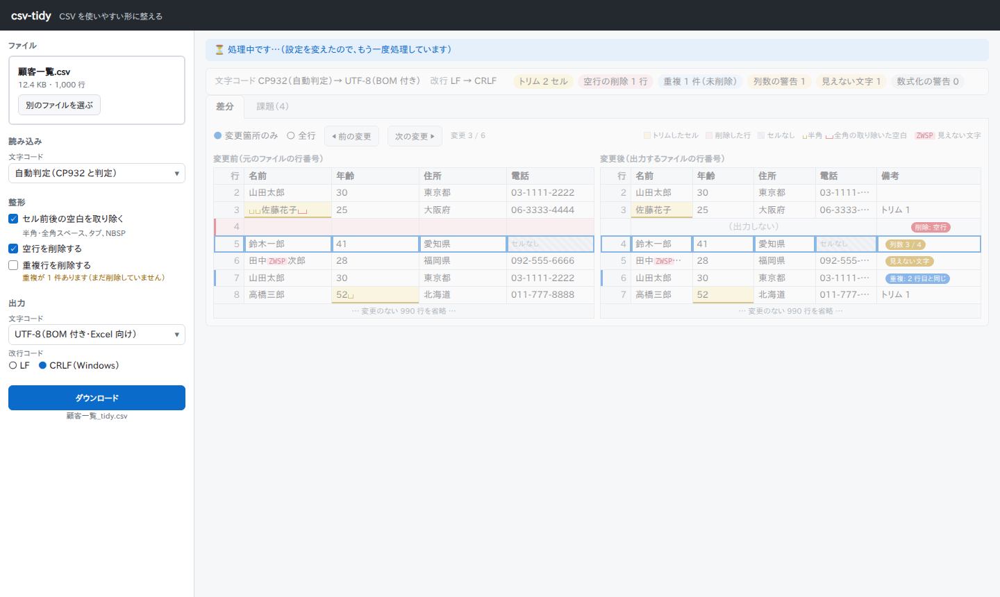
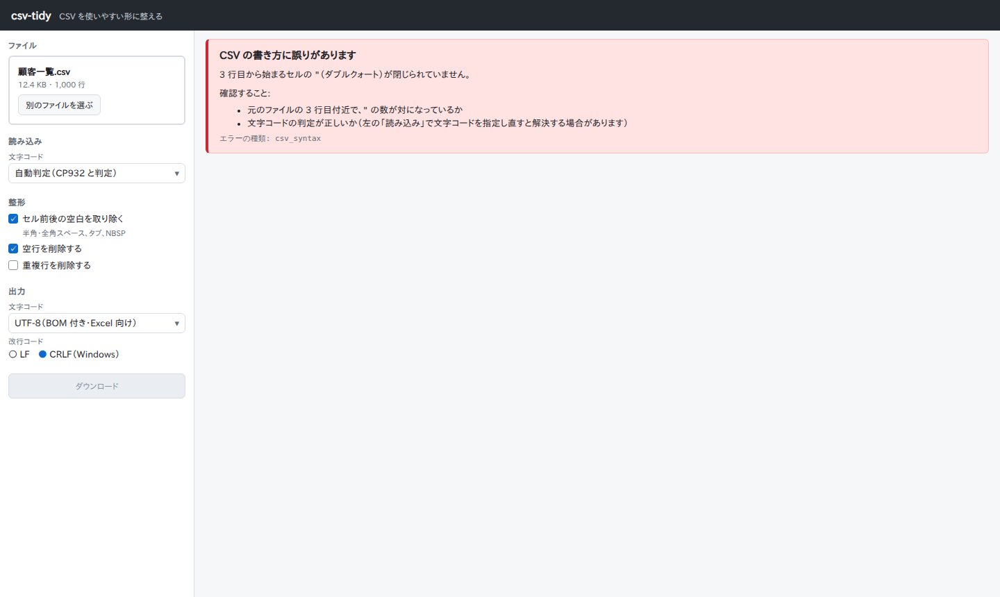
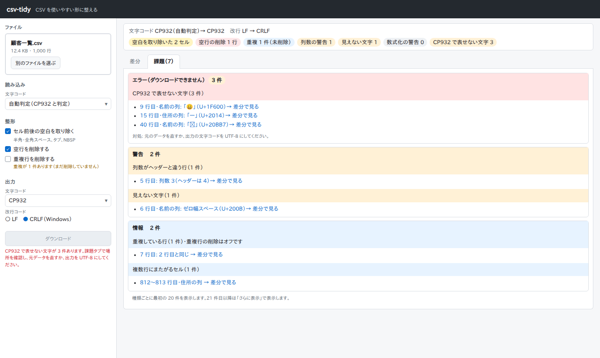
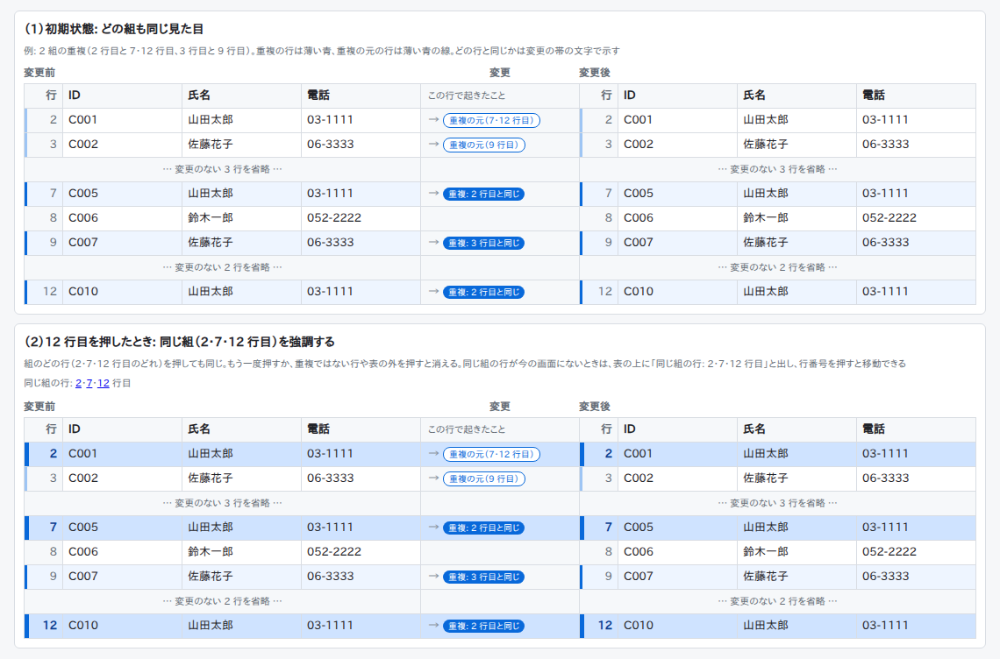
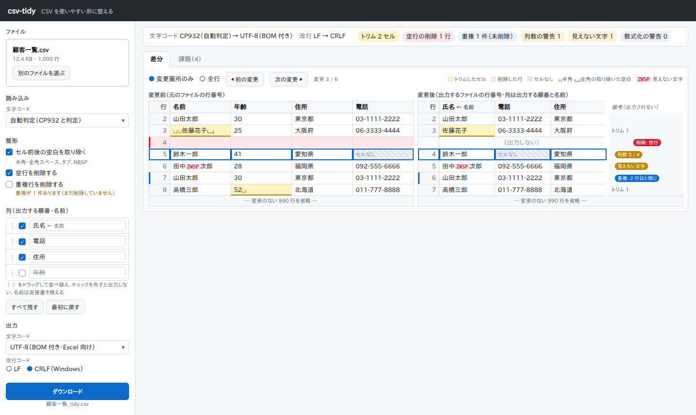
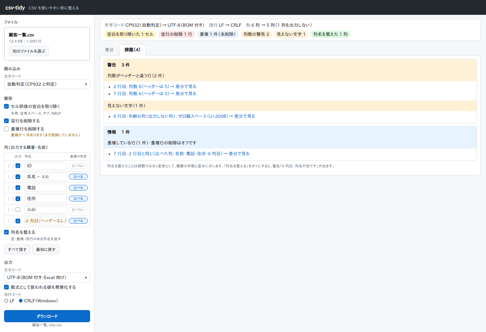
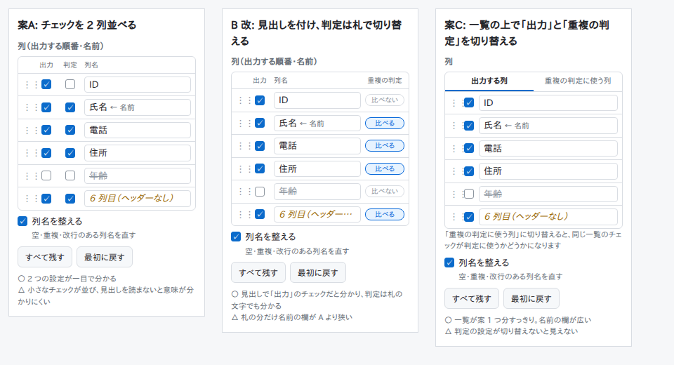

# csv-tidy 画面設計書

- 版: 第1版
- 作成日: 2026-10-04
- 対象リリース: v0.1（v0.2 の列の操作の画面と操作の単位を含む）
- 前提: [requirements.md](requirements.md)、[design.md](design.md)
- 用語: 分からない用語は [glossary.md](glossary.md) を参照

画面の見本（動かない HTML）は [mockups/](mockups/) にある。ブラウザで開くと実際の見た目を確認できる。この文書の画像は、その見本を撮影したもの。

## 1. 方針

| 方針 | 内容 | 決めた理由 |
| --- | --- | --- |
| 1画面で完結する | ページを移動せず、1つの画面の表示を切り替えて操作する | 設定を変えながら結果を確かめる使い方が中心のため |
| 左に設定、右に結果 | 左の細い欄（幅 280px）にファイル選択・設定・ダウンロードを固定し、右の広い領域に結果を出す | 結果を見ながら設定を変えられる |
| 設定を変えたらすぐ処理し直す | 「適用」ボタンを置かない | 結果がすぐ分かり、適用し忘れて表示と設定が食い違うことがない |
| 色だけに頼らない | 変更の種類は、色に加えて文字（バッジ）や記号でも示す | 色の見分けにくい人にも伝わるようにする |
| 値は文字として表示する | セルの値は `textContent` で入れる（design.md 12章） | 悪意のある CSV でもスクリプトが実行されないようにする（NFR-07） |

画面の大きさは、PC の横長の画面（幅 1280px 以上）を前提にする（NFR-10）。

## 2. 画面の状態

画面は1つで、状態によって右側の表示が変わる。状態の移り変わりは [design.md](design.md) の 10.2 の状態遷移図のとおり。

| 状態 | 右側の表示 | 左側の設定欄 | 見本 |
| --- | --- | --- | --- |
| 未選択 | 使い方の案内 | ファイル選択だけ操作できる。他の設定は薄く表示して押せない | [01-empty](mockups/01-empty.html) |
| 処理中 | 前回の結果を薄く表示し、上に「処理中です」を出す | 操作できる（操作すると処理をやり直す） | [04-loading](mockups/04-loading.html) |
| 結果の表示中 | 概要、差分タブ、課題タブ | すべて操作できる | [02-result-diff](mockups/02-result-diff.html)、[03-result-issues](mockups/03-result-issues.html) |
| 結果の表示中（ダウンロードできない） | 同上。課題タブにエラーの一覧 | ダウンロードのボタンを押せない。理由をボタンの下に表示 | [06-unencodable](mockups/06-unencodable.html) |
| エラーの表示中 | エラーの内容と確認すること | すべて操作できる（文字コードを指定し直して回復できるようにする） | [05-error](mockups/05-error.html) |

### 2.1 未選択



### 2.2 結果の表示中（差分タブ）



### 2.3 結果の表示中（課題タブ）



### 2.4 処理中



### 2.5 エラーの表示中



### 2.6 ダウンロードできない状態



## 3. 左の設定欄

上から順に並べる。

| 区画 | 要素 | 種類 | 初期値 | 動き | 関連する要件 |
| --- | --- | --- | --- | --- | --- |
| ファイル | ファイルを置く場所 | ドラッグ＆ドロップ（ファイルを引っ張ってきて放す操作）の受け口 | ― | CSV を放すと読み込む。読み込み後はファイル名・大きさ・行数を表示する | FR-01 |
| ファイル | 「ファイルを選ぶ」ボタン | ボタン | ― | ファイルを選ぶ画面を開く。読み込み後は「別のファイルを選ぶ」に変わる | FR-01 |
| ファイル | 大きさの確認 | ― | ― | 10,485,760 バイトを超えるファイルは送信せず、その場でエラーを表示する | FR-02, D5 |
| 読み込み | 文字コード | 選択肢 | 自動判定 | 「自動判定」「UTF-8（BOM 付き）」「UTF-8」「CP932」。自動判定のときは「自動判定（CP932 と判定）」のように結果を表示する | FR-11, FR-12 |
| 整形 | セル前後の空白を取り除く | チェック | オン | 対象の文字（半角・全角スペース、タブ、NBSP）を補足に書く | FR-20 |
| 整形 | 空行を削除する | チェック | オン | | FR-21 |
| 整形 | 重複行を削除する | チェック | **オフ** | オフでも重複があれば「重複が N 件あります（まだ削除していません）」と下に表示する | FR-22 |
| 出力 | 文字コード | 選択肢 | UTF-8 | 「UTF-8」「UTF-8（BOM 付き・Excel 向け）」「CP932」 | FR-14 |
| 出力 | 改行コード | 2つから1つを選ぶ | LF | 「LF」「CRLF（Windows）」 | FR-15 |
| 出力 | 数式として扱われる値を無害化する | チェック | **オン** | CSV インジェクション対策。先頭が `=` `+` `-` `@` などの値の前に `'` を付ける（数値は除く）と補足に書く（作業12 で追加） | FR-49 |
| ダウンロード | 「ダウンロード」ボタン | ボタン | ― | 下に保存するファイル名（`元の名前_tidy.csv`）を表示する。出力できないときは押せず、理由を赤字で表示する | FR-16, FR-50 |

## 4. 右の結果エリア

### 4.1 概要（常に上に表示）

- 1行目: 文字コードと改行コードの変換（例: `CP932（自動判定）→ UTF-8（BOM 付き）`、`LF → CRLF`）（FR-47）
- 2行目: 件数を色付きの札で並べる。空白を取り除いたセル、削除した空行、重複（削除したか未削除か）、列数の警告、見えない文字、数式になる値（作業19 で「数式化の警告」から変更）、CP932 で表せない文字（FR-46）。v0.2 で「列名を整えた」を加えた

### 4.2 タブ

「差分」と「課題（件数）」の2つのタブを切り替える。初期表示は「差分」タブ。ただし、ダウンロードできない状態になったときは「課題」タブを開く。

### 4.3 差分タブ

| 要素 | 内容 | 関連する要件 |
| --- | --- | --- |
| 表示の切り替え | 「変更箇所のみ」（初期）と「全行」 | FR-44 |
| 移動のボタン | 「◀ 前の変更」「次の変更 ▶」と「変更 3 / 6」のような位置の表示 | FR-44 |
| 凡例 | 色と記号の意味 | ― |
| 左の表 | 変更前。行番号は元のファイルの行番号 | FR-42 |
| 右の表 | 変更後。行番号は出力するファイルの行番号 | FR-42 |
| 変更の帯 | 左右の表の間に置く幅 180px の帯。その行で起きたことを「→ 削除: 空行」「→ 列数 3 / 4」のように、矢印とバッジ（色付きの小さな札）で書く。どちらの表にも属さないので、データの列とは混同しない | FR-43 |

左右の表と変更の帯は、行を CSV のレコード単位でそろえる（FR-42）。3 つとも行の高さを 28px に固定し、文字とバッジは左寄せ・縦は中央にそろえる。

**変更の示し方**

| 変更・課題 | 左の表（変更前） | 変更の帯 | 右の表（変更後） |
| --- | --- | --- | --- |
| 空白を取り除いたセル | 黄色。取り除いた空白を記号で示す（半角は細い「⊔」、全角は赤く太い「⊔」） | 「→ 空白を取り除いた（N セル）」 | 黄色。取り除いた後の値 |
| 削除した行 | 赤い背景と左端の赤い線 | 「→ 削除: 空行」「→ 削除: 重複」（赤） | 「（出力しない）」 |
| 重複（削除していない） | 行全体を薄い青、左端に濃い青の線（作業15 で変更。以前は左端の線だけ） | 「→ 重複: N 行目と同じ」（青） | 同左 |
| 重複の元の行（重複している行の最初の行。作業15 で追加） | 左端に薄い青の線。背景は塗らない | 白抜きの札「→ 重複の元（7・12 行目）」（青） | 同左 |
| セルがない（列数が足りない） | 斜線の背景に「セルなし」 | 「→ 列数 3 / 4」（黄土色） | 同左 |
| 見えない文字・制御文字 | 文字の位置に `ZWSP` のような赤い札 | 「→ 見えない文字」（黄土色） | 同左 |
| 数式になる値（数式化の警告） | ― | 「→ 数式になる値」（黄土色） | 該当するセルを黄土色の枠で囲む |
| 数式を無害化したセル | ― | 「→ 数式を無害化（N セル）」 | 緑。`'` を付けた後の値（作業12 で追加） |
| CP932 で表せない文字 | ― | 「→ CP932 で表せない」（赤） | 文字を赤い枠で囲む |
| 課題の一覧から移動してきた行 | 青い枠で強調 | 青い枠で強調 | 青い枠で強調 |

**変更の帯の中の順番と、収まらないとき（作業15 で追加）**

- 帯の中は、大事なものから並べる: 削除 → 重複（重複の元を含む）→ エラー（CP932 で表せない）→ 警告（列数・見えない文字・制御文字・数式になる値）→ 情報（複数行のセルなど）→ 説明（空白を取り除いた、数式を無害化、列名を整えた）。以前は見つかった順に並べていたため、重複のバッジが後ろに回り、帯の幅（180px）に収まらず隠れることがあった。
- 収まらない分は「他 N」と数で示す。マウスを重ねると、すべてを読める。行の見出しの「ヘッダー行」は、変更の内容より先に隠す（作業19 で決めた）。
- 同じ順位の中（例: 警告どうし）は、課題が見つかった順に並べる（作業18-2 で決めた）。「ヘッダー行」はどの行かを示す見出しなので、いつも先頭に置く。

**重複の組の示し方（作業15 で追加）**



見本: [10-v0.2-duplicates](mockups/10-v0.2-duplicates.html)

- 重複の組（重複の元の行と、それと同じ行）が複数あっても、色は 1 色だけにする。組ごとに色を変えると、組が多いときに見分けられず画面がごちゃごちゃするため。どの組かは、変更の帯の文字（「重複: 2 行目と同じ」「重複の元（7・12 行目）」）で示す。初期状態では、どの組も同じ見た目にする。
- 組のどの行（重複の元の行・重複している行のどれでも）を押しても、その組の行をすべて強調する。強調は、左の表・変更の帯・右の表の背景を一段濃い青にし、行番号を太字にし、左端の線を太くする。枠は使わない（セルごとや表ごとに枠が分かれて見づらくなるため）。
- 強調中の組の行をもう一度押すか、重複ではない行や表の外を押すと、強調を消す。別の組の行を押すと、強調をその組に切り替える。キーボードでは、左の表の行を Tab キーで選んで Enter キーで切り替える（作業18-2 で、選べる行を左の表に決めた）。
- 同じ組の行が今の画面にない（別のページにある、「変更箇所のみ」で省略されている）ときは、表の上に「同じ組の行: 2・7・12 行目」と出し、行番号を押すとその行へ移動できる。
- 「変更箇所のみ」の表示では、重複の元の行も変更のある行として表示に含める（比べる相手が省略されないようにするため）。
- 重複行の削除をオンにしたときは、重複している行は「削除した行」（薄い赤）になる。組の強調では、左端の線を青にし、背景は削除の赤のまま残す（削除したことが見えなくならないようにするため）。
- 課題の一覧の青い枠（課題から移動してきた行）とは別の目印なので、同時に出ても区別できる。
- この決まりは v0.1 の差分表示にも当てはめ、作業18（v0.2 の画面）で実装する。

**行の並べ方**

- 「変更箇所のみ」: 変更や課題がある行と、その前後 3 行を表示する。間は「… 変更のない N 行を省略 …」とまとめる（FR-44、要件定義書 7.1）。
- 「全行」: 100 行ずつのページに分け、ページを送るボタンを置く（要件定義書 7.1）。
- 長い値はセルの幅で切り、最後を「…」にする。マウスを重ねると全体を表示する。

### 4.4 課題タブ

- レベル（エラー・警告・情報）ごとにまとめ、その中を課題の種類ごとに分ける。それぞれの見出しに件数を出す（FR-16, FR-18）。
- 種類ごとに最初の 20 件を表示し、21 件目以降は「さらに表示」で表示する。
- 種類の見出しは、概要の札・変更の帯・用語の説明と同じ言葉を使い、言葉だけでは分かりにくいものに短い説明を括弧で添える（例: 「列数の警告（ヘッダーと列数が違う行）」。作業19 の用語の見直しで決めた）。
- 各項目は「5 行目: 列数 3（ヘッダーは 4）→ 差分で見る」のように書く。**押すと差分タブに切り替わり、その行へ移動して青い枠で強調する。** 「変更箇所のみ」の表示でその行が隠れているときは、その行を含むように表示を広げる。
- エラーの区画には、対処の方法（元データを直す、出力を UTF-8 にする）を書く。

## 5. 処理し直すきっかけ

| 操作 | 処理し直すか | 補足 |
| --- | --- | --- |
| ファイルを選ぶ・置く | する | 大きさの確認を通ったときだけ |
| 文字コード（読み込み）を変える | する | |
| 整形のチェックを切り替える | する | |
| 出力の文字コードを変える | する | CP932 で表せない文字の検査（FR-16）の結果が変わるため |
| 出力の改行コードを変える | する | 概要の変換表示が変わるため |
| 表示の切り替え・移動・タブ | しない | 画面の中だけで切り替える |
| v0.2: 列の名前を書き換える | する | 文字を打つたびではなく、打ち終わって 0.5 秒たってから処理する |

処理中に次の操作があったときは、前の処理の結果を捨て、最後の操作の結果だけを表示する（前の通信は打ち切る）。

## 6. エラーの表示

処理を中止するエラー（design.md 11.3）は、右側に赤い枠で表示する。

| 項目 | 内容 |
| --- | --- |
| 見出し | 何が起きたか（例: 「CSV の書き方に誤りがあります」） |
| 説明 | 場所と原因（例: 「3 行目から始まるセルの `"` が閉じられていません」） |
| 確認すること | 利用者が次にすること（例: 文字コードを指定し直す） |
| エラーの種類 | `csv_syntax` などのコード。小さく表示する |

エラーの種類ごとの文言は実装のときに決め、テスト計画で確認する。

## 7. v0.2: 列の操作

v0.2 で追加する列の操作（選択・並べ替え・名前の変更・削除）の画面と操作の単位を決める。要件は要件定義書 4.7 節（FR-60〜69）。v0.2 の画面設計（作業15、2026-10-06）で、列の一覧の置き方を 3 案から選び（8.1 の S10）、見本を作り直した。



見本: [07-v0.2-columns](mockups/07-v0.2-columns.html)（差分タブ）、[08-v0.2-issues](mockups/08-v0.2-issues.html)（課題タブ）

### 7.1 場所

左の設定欄の「整形」と「出力」の間に「列（出力する順番・名前）」の区画を置く。

| 要素 | 動き |
| --- | --- |
| 見出しの行 | 一覧の上に「出力」「列名」「重複の判定」の見出しを置き、各行の部品が何の設定かを示す |
| 列の一覧 | ヘッダーの列を元の順番で縦に並べる。ヘッダーにない列は「6 列目（ヘッダーなし）」のように斜体で加える（FR-60）。列が多いときはこの区画の中でスクロールする |
| ⋮⋮（つまみ） | ドラッグして順番を入れ替える（FR-62）。キーボードでは、つまみにフォーカスを合わせて ↑↓ キーで 1 つずつ動かす。動かした後もフォーカスはその列のつまみに残る（作業18 で追加） |
| 出力のチェック | 外すと、その列を出力しない。一覧では名前に取り消し線を引く（FR-61） |
| 列名の入力欄 | 書き換えると出力の列名が変わる。元の名前を「← 名前」と小さく添える（FR-63）。欄に収まらない名前は最後を「…」にし、マウスを重ねると全体を出す |
| 重複の判定の札 | 「比べる」（青い枠・青い文字・薄い青の背景）と「比べない」（灰色の枠・灰色の文字）を、押すたびに切り替える（FR-65）。色だけに頼らず文字も変える。ボタンとして作り、Tab キーで選んで Enter キー・スペースキーで切り替えられ、押されているかどうかを画面読み上げソフトに伝える（`aria-pressed`）。出力しない列でも押せる。出力のチェックを外しても札の状態は変えない。マウスを重ねると「この列を重複の判定に使う（押すと切り替え）」と出す |
| 「列名を整える」のチェック | 一覧の下に置く。初期状態はオン。補足に「空・重複・改行のある列名を直す」と書く（FR-66） |
| 「すべて残す」 | すべての出力のチェックを入れる |
| 「最初に戻す」 | 順番・名前・出力のチェック・判定の札を、読み込んだときの状態に戻す（FR-64）。読み込んだときの状態のままなら押せない |
| 列の数が変わったとき | 文字コードの指定し直しや空白の取り除きの切り替えで、ファイルの列数が変わることがある。このときは一覧を読み込んだときの状態に戻し、一覧の下に「ファイルの列が変わったため、列の一覧を最初の状態に戻しました。」と出す（設計書 V2。作業18 で追加） |
| 列名の表示 | 空の列名は「3 列目（空）」、ヘッダーにない列は「6 列目（ヘッダーなし）」と入力欄に薄く出す。列名の中の改行は「↵」で示す（作業18 で追加） |

チェックと札で形を変えるのは、隣り合う 2 つの設定を押し間違えにくくするため（8.1 の S10）。

### 7.2 操作の単位: 最終形を指定する

列の一覧そのものが「出力する列の順番・名前・残すかどうか」を表す。操作の履歴は持たない。

```json
{
  "columns": [
    { "source": 0, "name": "氏名", "keep": true, "compare": true },
    { "source": 3, "name": "電話", "keep": true, "compare": true },
    { "source": 2, "name": "住所", "keep": true, "compare": true },
    { "source": 1, "name": "年齢", "keep": false, "compare": false }
  ]
}
```

- `source` は元の何列目か（0 から数える）。`name` は出力する列名。`keep` は出力するかどうか。`compare` は重複の判定に使うかどうか（v0.2 の要件定義で追加。FR-65）。配列の順番が出力する順番。
- 操作の順番を気にしなくてよく、「最初に戻す」も読み込んだときの一覧に戻すだけで済む。
- 処理設定の保存を追加する場合（v0.2 の後で決める）も、この一覧を保存すればよい。

### 7.3 差分表示への影響

- 左の表（変更前）は元の列の順番のまま、右の表（変更後）は出力する列の順番と名前で表示する。
- 右の表の見出しで、名前を変えた列は「氏名 ← 名前」のように元の名前を添える。
- 列を並べ替えた結果、行の途中に来た「セルなし」は空のセルとして出力する（要件定義書 FR-62）。右の表では空のセルとして示し、マウスを重ねると「元はセルなし。空のセルとして出力」と出す。
- 出力しない列は右の表に出さない。
- 見出しで、「列名を整える」で直した列は薄い緑の背景と下線で示し、「列6 ← 空」のように元の名前を添える。変更の帯のヘッダーの行に「ヘッダー・列名を整えた（N 列）」と書く。概要の件数に「列名を整えた N 列」を加え、概要の 1 行目に「列 6 列 → 5 列（1 列を出力しない）」のように列の数の変化を書く。
- 変更の帯で、出力しない列のセルについての警告のバッジには「出力しない列」と小さく添える。
- 課題の一覧で、出力しない列のセルについての警告には「（出力しない列）」と添える（例: 「4 行目・メモの列（出力しない列）: ゼロ幅スペース（U+200B）」。FR-67）。

### 7.4 課題の一覧（v0.2）



- 重複している行の項目に、比べた列を書く（例: 「7 行目: 2 行目と同じ（比べた列: 名前・電話・住所・6 列目）」）。判定に使う列を変えたことに気づけるようにするため。すべての列を比べたとき（初期状態）は「（比べた列: すべての列）」と短く書く（作業19 で決めた）。
- 列名を整えたことは課題ではなく変更なので、課題の一覧には出さず、概要の件数と差分に示す（空白を取り除いたセルと同じ扱い）。
- 「列名を整える」をオフにしたときは、あるべき姿でない列名を警告する（例: 「6 列目: 列名が空です」「2 列目と 4 列目: 列名「名前」が重複しています」「5 列目: 列名に改行があります」）。

### 7.5 v0.2 の要件定義で決めたこと（2026-10-06）

検討していた 3 つの論点は、要件定義書 第11版で次のように決めた（要件定義書 付録 A の 38〜42）。

| 論点 | 決定 | 要件 |
| --- | --- | --- |
| 列名の重複や空の列名を許すか | ヘッダーのあるべき姿（名前がある、重複しない、改行がない）を決め、「列名を整える」処理（初期状態オン）で直す。オフのときは警告する | FR-66 |
| ヘッダーのない列の扱い | 一覧に「N 列目（ヘッダーなし）」として加え、初期状態では残す | FR-60 |
| 重複の判定との順番 | 判定に使う列を、出力する列とは別に選べるようにする。初期状態は出力する列すべて | FR-65 |

## 8. 決定事項と仮定

### 8.1 決定事項（2026-10-04 に開発者が決定）

| # | 項目 | 決定 |
| --- | --- | --- |
| S1 | 画面全体の配置 | 左に設定、右に結果 |
| S2 | 処理し直すタイミング | 設定を変えたらすぐ |
| S3 | ファイルの選び方 | ボタンとドラッグ＆ドロップ |
| S4 | 成果物の形 | 画面設計書（md）と動かない HTML の見本 |
| S5 | 結果エリアの並び | 概要を上に固定し、下を「差分」「課題」のタブで切り替える |
| S6 | 課題から差分への移動 | 課題を押すと差分タブの該当する行へ移動する |
| S7 | v0.2 の列の操作の場所 | 左の設定欄に列の一覧を置く |
| S8 | v0.2 の列の操作の単位 | 最終形を指定する |
| S9 | 差分の行ごとの説明の置き場所 | 左右の表の間に「変更」の帯を置く（5 案から案A を選択。2026-10-04） |
| S10 | v0.2 の列の一覧の置き方 | 見出しの行（出力・列名・重複の判定）を付け、出力はチェック、重複の判定は「比べる／比べない」の札で切り替える（3 案から B 案を選び、見出しの行を加えた「B 改」。2026-10-06）。チェックを 2 列並べる案（A）は形が同じで押し間違えやすく、一覧の上で切り替える案（C）は判定の設定が切り替えないと見えないため採用しなかった |
| S11 | 重複の組の示し方と帯の中の順番 | 重複の行は 1 色にし、どの組かは文字で示す。組のどの行を押しても組全体を背景の色で強調する（枠は使わない）。帯の中は大事なものから並べ、収まらない分は「他 N」で示す（2026-10-06。4.3） |

### 8.2 仮定（画面設計の段階で置いた内容。レビューで変更してよい）

- 左の設定欄の幅は 280px、画面の幅は 1280px 以上を前提にする。
- 色の割り当て: 空白を取り除いたセルは黄、削除は赤、重複は青、警告は黄土色、情報は水色。
- 取り除いた空白は「⊔」の形の記号で示し、全角は赤く太くして区別する。
- 長い値はセルの幅で切り、マウスを重ねると全体を表示する。
- v0.2 の列の名前は、打ち終わって 0.5 秒たってから処理し直す。
- 処理中に次の操作があったら、前の通信を打ち切る。

## 9. 検討の記録: 差分の行ごとの説明の置き場所（S9）

最初の見本では、右の表の右端に「備考」の列を置いていた。レビューで次の指摘があり、5 つの案を比べた。

- 備考が、データの列が追加されたように見える
- 備考がどの行に対応しているか分かりにくい。文字の揃えがばらばらで違和感がある

| 案 | 内容 | 評価 |
| --- | --- | --- |
| A | 左右の表の間に「変更」の帯を置く | どちらの表にも属さず、左右の行と同じ高さで並ぶ。押さずに内容が読める。表の幅が帯の分だけ狭くなる。**採用** |
| B | 備考を右の表の最後の列に戻し、太い縦線と行の帯で区切る | 実装は簡単だが、データの列に見えやすく、右の表の値が切れる |
| C | 備考の列をなくし、行番号の横の色の点と、押すと開く説明の行で示す | 表の幅を最も広く使えるが、押すまで内容が分からない |
| D | 行番号の隣に短い「状態」の列を置く（左右とも） | 実装は簡単。札の言葉が短く、詳しくはマウスを重ねる必要がある |
| E | 変更前と変更後を 1 つの表にまとめ、セルの中で取り消し線と色で示す | Word の変更履歴に近く、非エンジニアには分かりやすい。ただし FR-42（左右に並べる）の変更が必要 |

利用者は開発者本人とポートフォリオを見る人で、非エンジニアは含めない（要件定義書の L5 のとおり）ことを確認したうえで、案A を採用した。


## 10. 検討の記録: v0.2 の列の一覧の置き方（S10）

各列の行に「出力するか」「重複の判定に使うか」の 2 つの設定と列名の入力欄を、左の設定欄（幅 280px）に収める方法を 3 案比べた（2026-10-06）。



| 案 | 内容 | 評価 |
| --- | --- | --- |
| A | 見出しの行を付け、チェックを 2 列並べる | 2 つの設定を一度に見られる。同じ形のチェックが並ぶので、見出しを読まないとどちらがどちらか分かりにくく、押し間違えやすい |
| B | 出力はチェック、重複の判定は行の右端の「比べる／比べない」の札で切り替える | 札の文字で意味が分かる。最初の案には見出しの行がなく、出力のチェックの意味が説明文頼りで分かりにくいというレビューの指摘を受け、見出しの行を加えた「B 改」にした。**採用** |
| C | 一覧の上の切り替え（「出力する列」「重複の判定に使う列」）で、同じ一覧のチェックの意味を変える | 一覧がすっきりし名前の欄が広い。判定の設定は切り替えないと見えず、気づかないうちに判定が変わっていることがありうる |

## 11. 画面の用語の説明（「？」）

画面の専門用語の横に「？」のボタンを置き、押すとその場に短い説明の吹き出しを出す（要件定義書 NFR-13、2026-10-06 の開発者の決定）。仕組みは設計書 15.6。

| 項目 | 内容 |
| --- | --- |
| 置く場所 | 用語が見出しや札として出るところ（概要の件数の札、課題の一覧の種類の見出し、設定欄の項目、差分の凡例）。課題の一覧の各項目には「？」を付けず、短い説明を文章に添える（例: 「見えない文字（幅のない文字。コピーした文章に混ざりやすい）: ゼロ幅スペース U+200B」） |
| 吹き出しの中身 | 1 行目に用語、2 行目に何か（40 字まで）、3 行目になぜ困るか・どうするか（60 字まで） |
| 閉じ方 | もう一度押す、Esc キー、吹き出しの外を押す。一度に 1 つだけ開く |
| 進め方 | 用語はその画面を作るときに説明を書いて足す。v0.1 の用語は作業18-2 でまとめて入れ、作業19 で全体を見直す |
| 置いた場所（作業18-2） | 設定欄: 読み込みの文字コード（`bom`）、空白の取り除き（`nbsp`）、重複行の削除（`duplicate`）、列の一覧の見出し（`not_output`・`headerless`・`compare`）、列名を整える（`tidy_names`）、出力の文字コード（`cp932`）、数式の無害化（`formula_escape`）、改行コード（`newline`）。概要の件数の札、課題の一覧の種類の見出し、差分の凡例（`formula_escape`・`tidy_names`・`missing_cell`・`invisible_char`） |
| 部品の作り | 「？」はチェックの `label` の外に置く（チェックの名前に説明の文字が混ざらないように）。吹き出しは画面に対して位置を決め（`position: fixed`）、表の枠で切れないようにする。画面を作り直す・スクロールするときも閉じる |

例（見えない文字）:

> **見えない文字**
> 画面に何も表示されない、幅のない文字です（ゼロ幅スペース U+200B など）。
> 見た目が同じでも別の値として扱われ、検索や重複の判定で一致しません。
